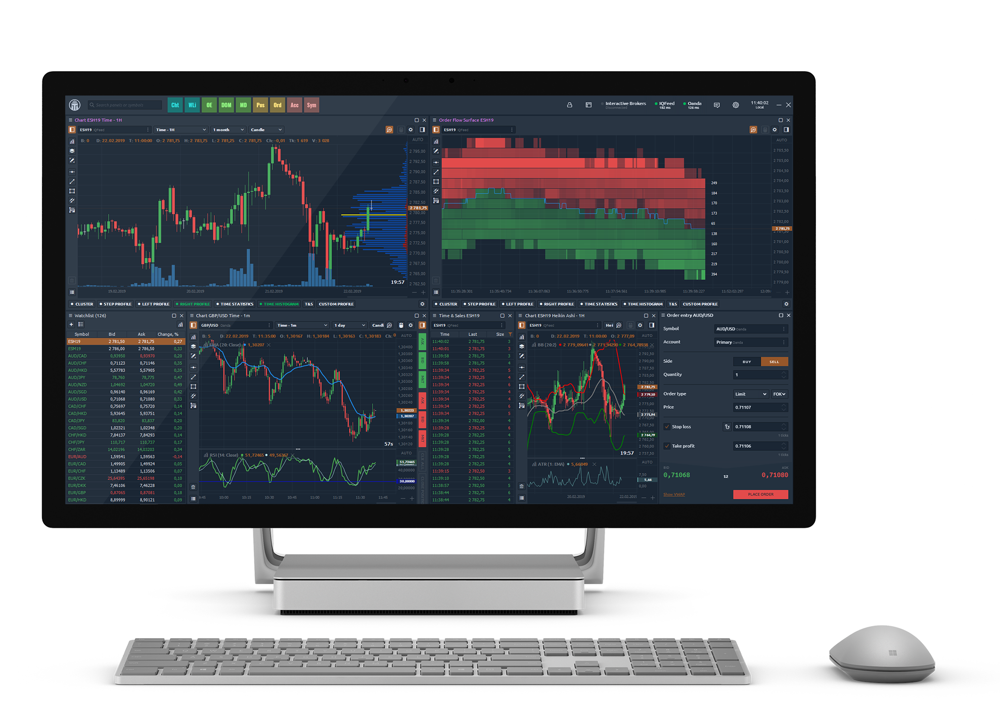

# Welcome to Coincidence Help

For the answers you can't find in the Knowledge Base, please contact us via the following options:

* \*\*\*\*[**Telegram Support Chat**](https://t.me/quantower)\*\*\*\*
* \*\*\*\*[**Live Chat on our website**](https://www.quantower.com/) \(pop-up window in the lower right\)
* Email us at **info@quantower.com**

For ease of navigation, the Knowledge Base is divided into several categories that will allow you to quickly find the information you need:































