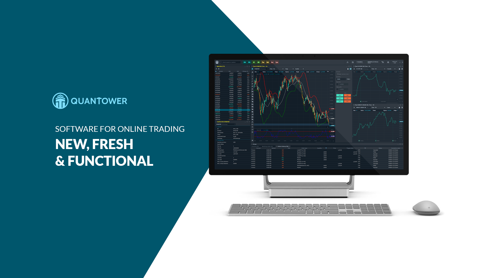

# Welcome to Quantower Help

Here in **Help**, you’ll find all the detailed documentation for [Quantower features](https://www.quantower.com/features), learn how to create and customize your Workspace, understand all settings, get to know advanced features, and more.

For ease of navigation, the Help system is divided into several categories that will allow you to quickly find the information you need:

* [Getting started](https://help.quantower.com/getting-started)
* [Control center and user interface](https://help.quantower.com/control-center-and-interface)
* [Charting & Technical analysis](https://help.quantower.com/charting-and-technical-analysis)
* [Trading functionality](https://help.quantower.com/trading-functionality)
* [Positions and portfolio management](https://help.quantower.com/positions-and-portfolio-management)
* [Informational panels](https://help.quantower.com/informational)
* [Miscellaneous panels](https://help.quantower.com/misc)

