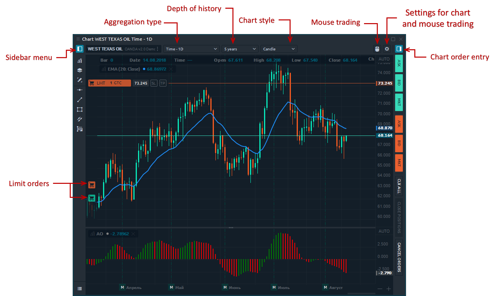

# Chart

### General info

The chart panel is one of the most important panel for an active trader. Accurate market data, graphical and analytical tools are integral components of the panel, which allow you to make the right trading decisions.

