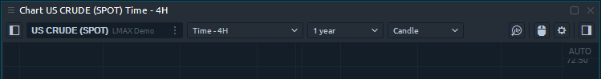
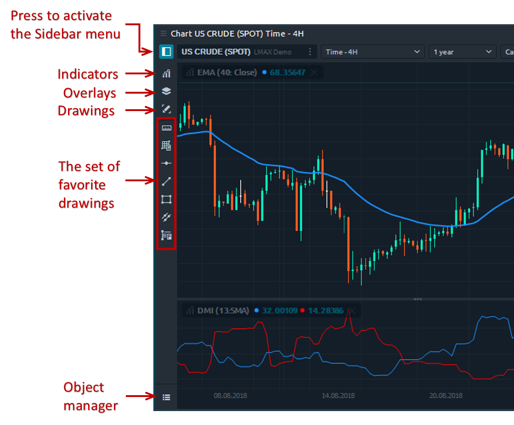

# Chart

### General info

The chart panel is one of the most important panel for an active trader. Accurate market data, graphical and analytical tools are integral components of the panel, which allow you to make the right trading decisions.

The chart panel can be divided into 5 parts:

* primary or **top toolbar** with the main controls
* **the chart area** itself with the displaying of price data, indicators, positions
* **sidebar menu** with controls of indicators, drawings, overlays and object manager
* **chart order entry** with hot buttons for quick trading
* bottom toolbar with **volume analysis tools**

### Top toolbar

The top toolbar allows you to select a trading instrument, set the chart type and style, timeframe, depth of market data as well as call additional toolbars. Here is the list of [chart types and styles](https://help.quantower.com/analytics-panels/chart/chart-types) where you can find a detailed explanation of how to build them.

### Sidebar menu or object toolbar

The sidebar menu allows you to add an indicator to the chart, a drawing tool or an overlay, and also manage all objects through the object manager.

For traders who often refer to certain drawings, there is an option to fix them on the Sidebar. For this, near each drawing there is an "Star" icon, upon activation of which you add them to the Favorite List.

