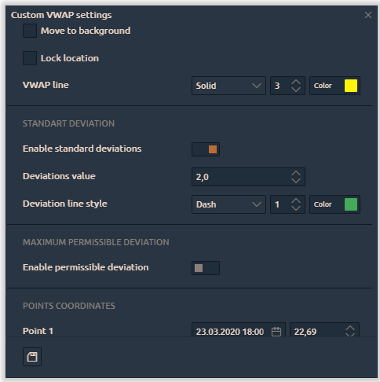

# Anchored VWAP

Specify the start point on the chart and anchored VWAP will draw a line to the current moment. Also, you can specify the endpoint for the line, set Standard Deviation and Maximum Permissible Deviation.

By clicking on the "**Gear"** icon, you can customize settings of the selected VWAP

* **VWAP line** — set the main line type, its thickness and color
* **Standard Deviation Bands**. When the parameter is active, the standard deviation lines up and down from VWAP will be additionally calculated on the chart. Specify the number of standard deviations in the _**"Value"**_ field and colors
* **Maximum Permissible Deviation \(MPD\).** MPD is similar to the standard deviation but is calculated as \(VWAP period high - VWAP period low\)/2.
* **Points coordinates** — defines the starting point for custom VWAP
* **Visible on specified timeframes** — this setting allows you to specify on which timeframes VWAP will be displayed.

