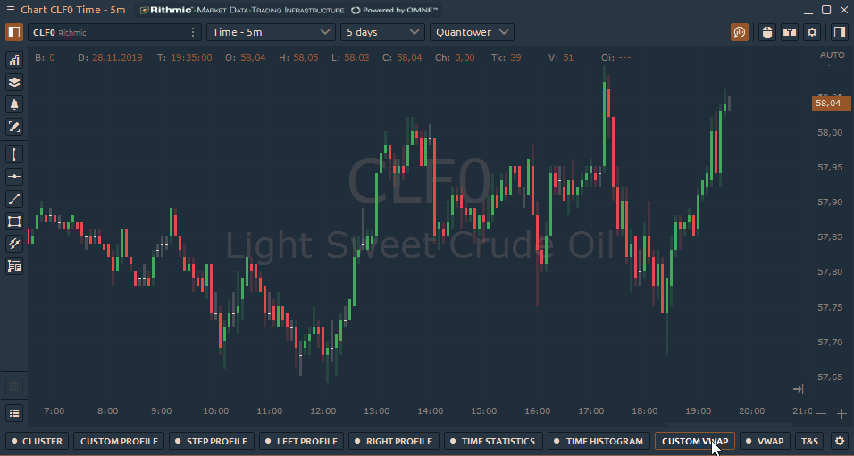

# Anchored VWAP

Specify the start point on the chart and anchored VWAP will draw a line to the current moment. Also, you can specify the endpoint for the line, set Standard Deviation and Maximum Permissible Deviation.

By clicking on the "**Gear"** icon, you can customize the settings of the selected VWAP

<figure><figcaption>
Settings of Custom VWAP (Anchored VWAP)
</figcaption></figure>

* **VWAP line** — set the main line type, its thickness, and color
* **Left Range** — defines the starting point for custom VWAP\

*   **Mode** — there are 2 modes — **Anchored, and Custom** — that control the right range of the VWAP:\
    &#x20;  **Anchored mode** fixes only the left range or the starting point of the VWAP calculation. The right range automatically moves with each new bar. Thus, the VWAP is updated in real-time with each new bar.\
    &#x20;  **Custom mode** fixes both borders of the range for the VWAP calculation.\

    <figure><figcaption></figcaption></figure>
* **Data type** — set the data for VWAP calculation: **Ticks** or **Current TF.**\
  &#x20;  **Ticks** will use tick data for VWAP calculation and will take much more time for loading\
  &#x20;  **Current TF** will use Bar data from the current selected Timeframe of your chart. It will use Price type data and multiply it by Bar Volume.\

* **Price Type** — select the price for the Current TF data type (Open, High, Low, Close, HL/2, HLC/3, OHLC/4)

<figure><figcaption></figcaption></figure>

* **Standard Deviation Bands**. When the parameter is active, the standard deviation lines up and down from VWAP will be additionally calculated on the chart. Specify the number of standard deviations in the _**"Value"**_ field and colors
* **Maximum Permissible Deviation (MPD).** MPD is similar to the standard deviation but is calculated as (VWAP period high - VWAP period low)/2.
* **Visible on specified timeframes** — this setting allows you to specify on which timeframes VWAP will be displayed.
