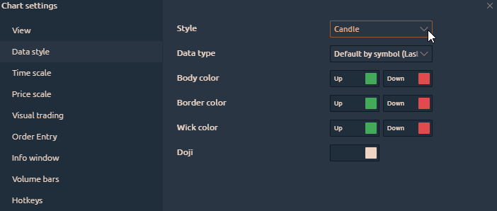
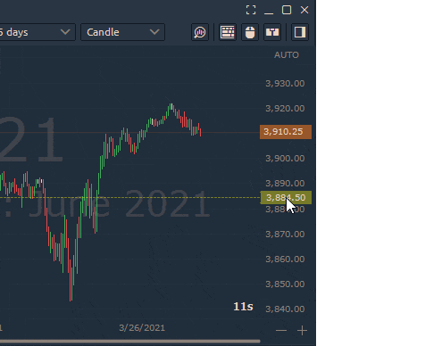
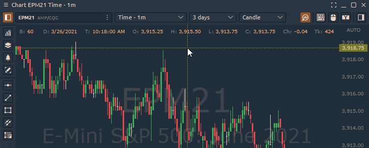

# Chart Settings

There are two ways to open the Chart Settings:

**1)** Click on the '<mark style="background-color:blue;">Menu</mark>' button in the top left corner and select the '<mark style="background-color:blue;">**Settings**</mark>' option.

<figure><figcaption>
Open Chart Settings via main menu button
</figcaption></figure>

**2)** Right-click on the chart and select the '<mark style="background-color:blue;">**Settings**</mark>' option.

<figure><figcaption>
Open Chart Settings via context menu
</figcaption></figure>

The General view of the Chart Settings menu has several sections. Let's take a closer look at them:

|                                                  |                                                        |                                                  |
| ------------------------------------------------ | ------------------------------------------------------ | ------------------------------------------------ |
| [**View**](chart-settings.md#view-settings)      | [**Visual trading**](chart-settings.md#visual-trading) | [**Volume bars**](chart-settings.md#volume-bars) |
| [**Data style**](chart-settings.md#data-style)   | [**Order entry**](chart-settings.md#order-entry)       | **Event trading**                                |
| [**Time scale**](chart-settings.md#time-scale)   | **Quick ruler**                                        | [**Hotkeys**](chart-settings.md#hotkeys)         |
| [**Price scale**](chart-settings.md#price-scale) | [**Info window**](chart-settings.md#info-window)       |                                                  |

## View settings

<figure><figcaption>
General View of Chart Settings
</figcaption></figure>

* **Custom title**\
  You can rename your chart panel as desired.
* **Use custom tick size**\
  This setting is particularly useful for highly volatile instruments like BTC or Nasdaq (NQ) futures. It aggregates multiple specified tick levels into a single level, often used for a more compact display of [**Level2 data**](technical-indicators/volume/level2-indicator.md)**,** [**Volume Profile**](volume-analysis-tools/volume-profiles.md)**, or** [**Cluster charts**](volume-analysis-tools/cluster-chart.md). For example, you can see a Bitcoin chart compressed at $10 intervals, offering a clearer view of Level2 indicator.

<figure><figcaption></figcaption></figure>

<figure><figcaption></figcaption></figure>

* **Time Zone**\
  These are the time zone settings for the chart.
* **Mouse wheel action**\
  This defines the action that occurs when the user rotates the mouse wheel.
* **Mouse wheel + CTRL action.**
* **Mouse wheel + SHIFT action.**\
  &#x20;\
  For all Mouse wheel actions, there are four options available: **Scroll, Zoom of the Chart Area, Zoom to Cursor, and Price scale Zoom.**

<figure><figcaption>
Various mouse wheel actions for the chart panel
</figcaption></figure>

* **Drawings default availability**\
  If you choose <mark style="color:blue;">'</mark><mark style="background-color:blue;">**All Charts with the Same Symbol**</mark><mark style="color:blue;">,'</mark> all drawings will be applied to other charts with the same asset (ticker). This also allows you to change the color settings of the drawings on all charts at the same time.

<figure><figcaption></figcaption></figure>

.png>)



*   **Plates alignment mode.** The option controls the placement of indicator names on the chart within the Quantower platform. It offers two display modes: **Vertical** and **Horizontal**.\

    <figure><figcaption></figcaption></figure>
* **Window colors.**  Settings for the background color on the chart.\

*   **The Abbreviation Rules** option gives you the ability to simplify the values of trading sizes for easier readability. There are 3 options for Format Mode:\
    \
    **Default:** This option displays values as is, without any abbreviation or rounding.\
    \
    **Round to:** This option rounds values after the decimal point to the specified number of decimal places.

    \
    **Abbreviate:** This option abbreviates values to the shortest form, such as "K" for thousands, "M" for millions, etc.\

* **Crosshair.** These are the settings of the cursor and its visibility on charts with one symbol (asset).
* **Grid.** Settings for the grid lines on the chart (horizontal and vertical grid).
* **Time to next bar.** These are settings for displaying time to the next bar and changing its color.
* **Additional.** It is used to enable/disable toolbars and misc data on a chart.

<figure><figcaption></figcaption></figure>

## Data style

This tab controls the visual settings of the chart data. Here you can change the Chart Style (e.g., Candles, Bars, Area, Line) and set colors for the Up & Down Bars. Try to create an attractive interface that is easy on your eyes.

## Time scale

Use this tab to adjust the time scale. You can select the font size and color, as well as the background color for the timeline. You can also control the vertical period separators, such as Daily, Weekly, Monthly, and Yearly, and display them in different colors as desired.

<figure><figcaption></figcaption></figure>

## Price Scale

These settings allow you to customize the price scale. There are three important points here, let's examine each one:

* **Scale type**. This allows you to choose which type of scale will be displayed on the chart, such as a normal display, percentage display, or logarithmic scale.

<figure><figcaption></figcaption></figure>

* **Zoom**. Here you can adjust the vertical scaling of the chart.

* **Highlight prices**. This feature adjusts the color and font of the current price on the chart.

<figure><figcaption></figcaption></figure>

It enables highlighting of the open price, and the previous day's minimums, maximums, and settlement price of the instrument. Additionally, it allows for the display of the bid and ask price spread.

<figure><figcaption></figcaption></figure>

<figure><figcaption>
Customize colors of Bid and Ask prices
</figcaption></figure>

## Visual trading&#x20;

This tab allows you to include settings to display the current position on the chart and display already completed trades.

.png>)

.png>)

**Show positions**. This option allows you to enable or disable the display of current positions on the chart.

.gif>)

The **Pnl** type allows you to choose the display of profit/loss on an open position in ticks or currency.


The **Pnl** type allows you to choose to display the position in currency only for those connections where this option exists.


**Show orders**. The option allows you to enable or disable the display of work orders on the chart.&#x20;

**Trade through Order entry panel**. If this option is enabled, mouse trade mode will be disabled, and when the mouse clicks on the chart, the associated order entry panel for this quote will automatically open. The mouse trade mode is the same as : clicking the right mouse button will open a panel for entering a limit order for a "Sell" deal at the marked price on the chart; click the left mouse button to open the panel for entering a limit order for a "Buy" deal at the marked price on the chart;

## Order entry

These are the settings of the order entry panel. The most interesting thing here is that you can set the standard number of entry orders which correspond to your risks. This is very convenient for manual trading.&#x20;

[How to use the order entry panel read here](../../trading-panels/order-entry/)

.png>)

**Mouse trading mode**. There are two modes available to choose from:

**single order**. Once the order is set, the mouse trading mode is automatically disabled.

**multiple orders**. Mouse trading mode will be active until it is deactivated.

.png>)

## Quick Ruler

<figure><figcaption></figcaption></figure>

## Info Window

This settings tab is for displaying values in the upper left corner. You can choose which data to display for yourself. You can also adjust the font size for this information.

<figure><figcaption>
Select the desired data for the  Info window
</figcaption></figure>

## Volume Bars

This tab is used to adjust the volume histogram at the bottom of the chart. You can choose the colors for the histogram that you prefer. You can also select a color scheme for coloring the chart, adjusting the color of the volume histogram based on the direction of the price bar, or changing the color depending on whether the volume is higher or lower at the moment.

.png>)

## Hotkeys

This tab is for configuring your keyboard shortcuts. Here, you can configure functions like changing the volume with one button, drawing levels or trend channels, canceling orders, and many other useful functions. In general, you can assign almost any action to your preferred key combination.

.png>)
