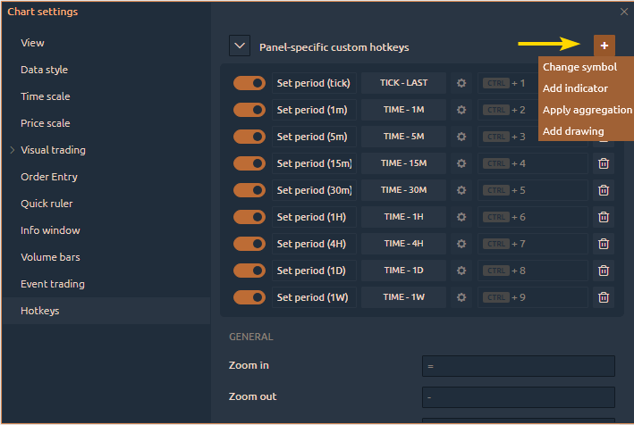
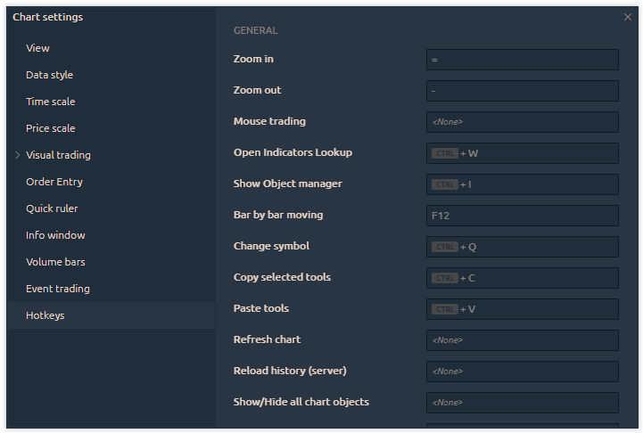
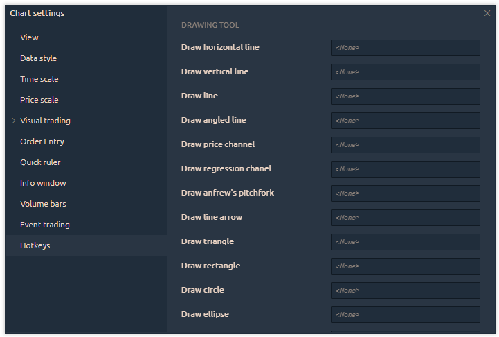
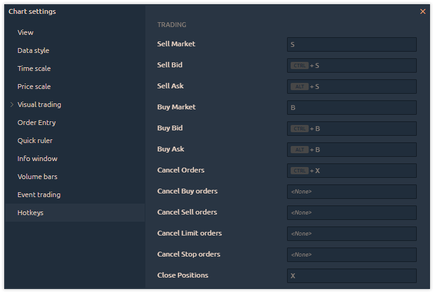

# Hotkeys

This tab allows you to configure your keyboard shortcuts. You can set up functions such as adjusting the order size with a single key, adding drawing levels or trend channels, canceling orders, and many other useful actions. In general, you can assign almost any action to your preferred key combination.

This category has four sections, each with its own types of hotkeys:

1. **Panel-specific custom hotkeys**:\
   Here, users can add additional (custom) hotkeys to perform tasks such as changing trading symbols, adding an indicator to the chart, changing the chart type or timeframe, or adding any drawing tool from the general drawings' list.

<figure><figcaption>
Panel-specific custom hotkeys
</figcaption></figure>

2. **General**:\
   This section contains predefined basic hotkeys that allow you to open windows for selecting drawing tools, symbols, and indicators, as well as hotkeys for activating certain functions on the chart.

<figure><figcaption></figcaption></figure>

3. **Drawing Tool**:\
   In this section, you can set up different hotkeys to quickly add various drawing tools to the chart.

<figure><figcaption></figcaption></figure>

4. **Trading Hotkeys**:\
   This section allows you to configure hotkeys for trading actions, such as placing or canceling orders, opening/closing positions, or managing order sizes.


**Note**: Trading hotkeys only work if the "<mark style="color:red;">**Enable Keyboard Trading**</mark>" option is turned on, which needs to be activated from the chart toolbar.


<figure><figcaption></figcaption></figure>
