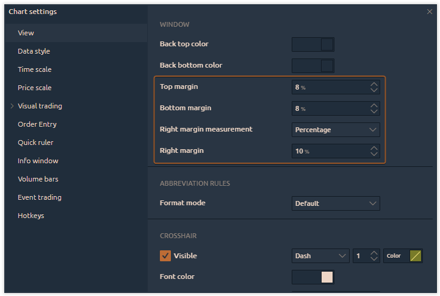
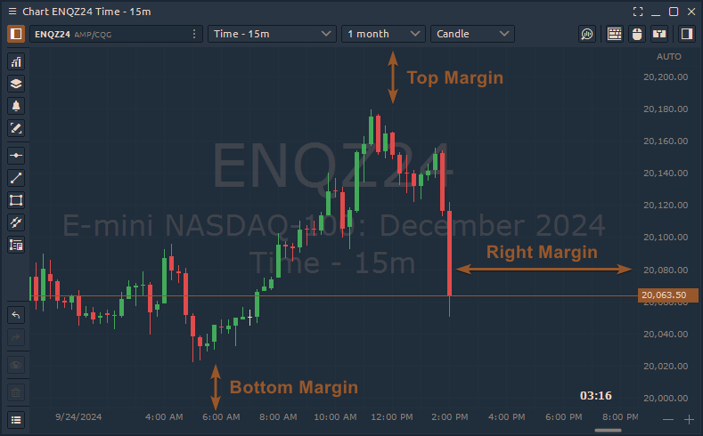
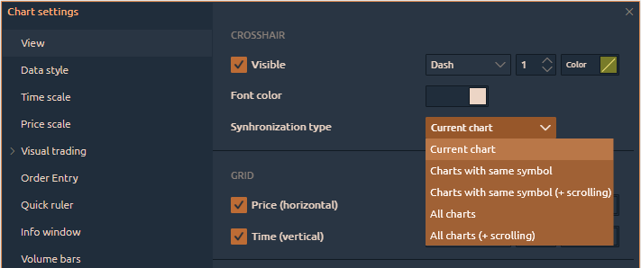
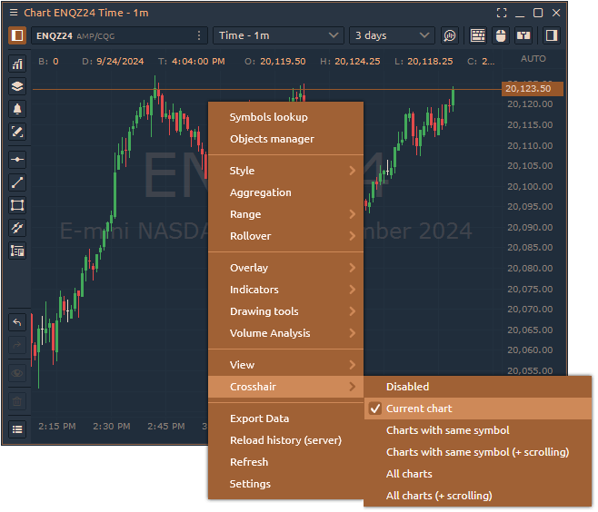
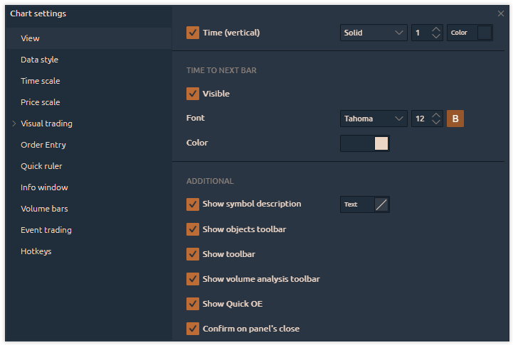

# View settings

<figure><figcaption>
General View of Chart Settings
</figcaption></figure>

### **Custom Title**

You can rename your chart panel to any name you like.

<figure><figcaption>
<strong>Custom title on panel's header</strong>
</figcaption></figure>

### **Use custom tick size**

This setting is useful for highly volatile instruments like Bitcoin (BTC) or Nasdaq (NQ) futures. It combines multiple tick levels into a single level, often for a more compact display of [**Level2 data**](../technical-indicators/volume/level2-indicator.md)**,** [**Volume Profile**](../volume-analysis-tools/volume-profiles.md)**, or** [**Cluster charts**](../volume-analysis-tools/cluster-chart.md). For example, you can see a Bitcoin chart compressed into $10 intervals, providing a clearer look at the Level 2 indicator.

<figure><figcaption></figcaption></figure>

<figure><figcaption></figcaption></figure>

### **Time Zone**

These settings control the time zone for the chart.

### **Mouse Wheel Action**

This setting defines what happens when you rotate the mouse wheel.

* **Mouse Wheel + CTRL Action**
* **Mouse wheel + SHIFT action**\
  \
  For all mouse wheel actions, you have four options: **Scroll, Zoom of the Chart Area, Zoom to Cursor, and Price scale Zoom.**

<figure><figcaption>
Various mouse wheel actions for the chart panel
</figcaption></figure>

### **Drawings Default Availability**

If you choose <mark style="color:blue;">'</mark><mark style="background-color:blue;">**All Charts with the Same Symbol**</mark><mark style="color:blue;">,'</mark> all drawings will be applied to other charts with the same asset (ticker). This also allows you to change the color of the drawings across all related charts at once.

<figure><figcaption></figcaption></figure>

.png>)



### **Plates Alignment Mode**

This option controls how indicator names are displayed on the chart in Quantower. There are two modes: **Vertical** and **Horizontal**.

<figure><figcaption></figcaption></figure>

### **Window colors**

Settings for the background color on the chart.

### **Top, Bottom, Right Margins**

Determine the distance of the current bar from the edge of the chart accordingly.

<figure><figcaption>
Margin settings for the chart space
</figcaption></figure>

<figure><figcaption></figcaption></figure>

### Abbreviation Rules

This option allows you to simplify the display of trading size values for easier readability. There are three modes:

* **Default**: Values are displayed as is, without abbreviation or rounding.
* **Round to**: Values are rounded to a specified number of decimal places.
* **Abbreviate**: Values are shortened, using "K" for thousands, "M" for millions, etc.

### **Crosshair**

This setting controls the visibility and appearance of the crosshair cursor on charts with the same or different symbols (assets). You can choose to display the crosshair only on the <mark style="color:green;">**current chart**</mark>, on <mark style="color:green;">**all charts with the same symbol**</mark>, or across <mark style="color:green;">**charts with different symbols**</mark>. A scrolling option is also available.


**Note:** If you want the crosshair to be synchronized across different charts, you must configure the crosshair separately on each chart.


<figure><figcaption>
Crosshair synchronization in a chart settings
</figcaption></figure>

<figure><figcaption></figcaption></figure>

### **Grid**

Settings for horizontal and vertical grid lines on the chart.

### **Time to next bar**&#x20;

These settings display the time remaining until the next bar and allow you to change its font and color.

### **Additional**

This section lets you enable or disable toolbars and other miscellaneous data on the chart.

<figure><figcaption></figcaption></figure>
