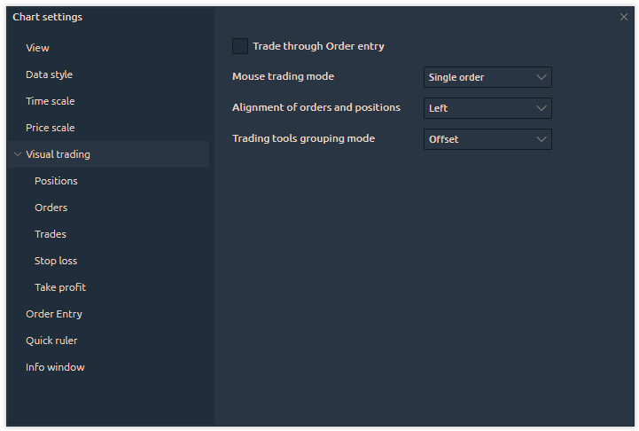
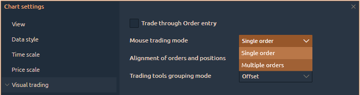

# Visual Trading

The "<mark style="background-color:orange;">**Visual Trading**</mark>" setting controls the display of open position markers, orders, and executed trades on the chart, as well as how they appear. For easier management, these settings are divided into subcategories:

* Positions
* Orders
* Trades
* Stop Loss
* Take Profit

<figure><figcaption></figcaption></figure>

The General Settings for the "<mark style="background-color:orange;">**Visual Trading**</mark>" category include two main options that control how orders are placed using Mouse Trading.

<figure><figcaption>
General settings for Visual Trading category
</figcaption></figure>

### **Trade through Order Entry**

When this option is enabled, the [<mark style="background-color:orange;">**Order Entry panel**</mark>](../../../../trading-panels/order-entry/) will appear when placing an order with <mark style="color:green;">**Mouse Trading**</mark>, allowing you to adjust order details. By default, this option is turned off.

<figure><figcaption>
Trade through Order Entry using Mouse trading
</figcaption></figure>

### **Mouse trading mode**

There are two modes for placing orders using the mouse:

<figure><figcaption>
Mouse trading mode
</figcaption></figure>

* **Single order:** Mouse Trading is automatically disabled after placing an order.
* **Multiple orders:** Mouse Trading stays active after placing an order, allowing you to place more orders until you turn it off on the main chart toolbar. The GIF below shows an example of using <mark style="color:green;">**Multiple Orders**</mark> mode for mouse trading.

<figure><figcaption>
Multiple Orders mode for trading via mouse
</figcaption></figure>


<mark style="background-color:green;">**Tip:**</mark> By holding the **CTRL** key, you can place multiple orders one after another.


### Alignment of Orders and Positions

This setting offers two options for placing markers on the chart: either on the <mark style="color:green;">**left**</mark> or <mark style="color:green;">**right**</mark> side.

More advanced placement settings for these markers can be found in the **Positions** and **Orders** sections.

<figure><figcaption>
Alignment of Orders and Positions on the chart
</figcaption></figure>

### Trading Tools Grouping Mode

This option defines how order and position markers are displayed when placed very close to each other on the chart. There are three grouping modes:

* **None**: Grouping is disabled, and all order and position markers may overlap as they are.
* **Offset**: Grouping shifts the markers vertically in a list-like arrangement, making them easier to manage on the chart.


**Note**: Only the markers are shifted; their prices remain at the levels set by the user.


* **Offset with Overlay**: Grouping shifts the markers vertically with slight overlapping for a more compact display.

<figure><figcaption>
Grouping modes for orders and positions
</figcaption></figure>
