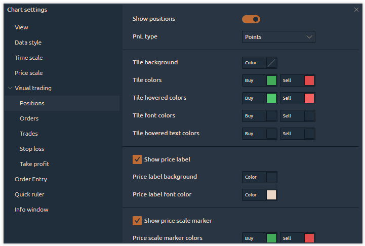

# Positions

In this category, the user can customize the visual settings for open positions, such as the types of PnL, colors, fonts, and the placement of position markers on the chart.

<figure><figcaption></figcaption></figure>
