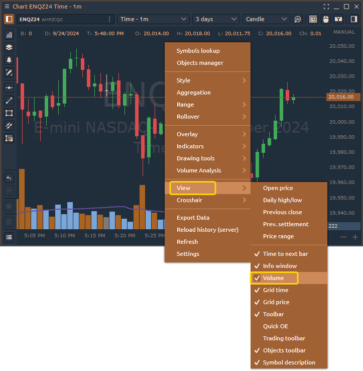

# Volume Bars

This tab allows you to customize the volume histogram displayed at the bottom of the chart. You can select your preferred colors for the histogram and choose a color scheme that changes based on price bar direction or current volume levels. You can set the colors to reflect whether the price bar is moving up or down, or whether the volume is increasing or decreasing at that moment.

<figure><figcaption>
Volume Bars at the bottom of the chart
</figcaption></figure>

The **Volume Bars** can be added to the chart through the context menu. Simply right-click on the chart, then select **View** -> **Volume**.

<figure><figcaption></figcaption></figure>
