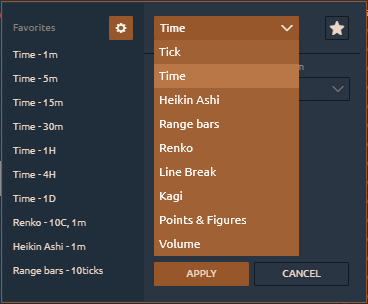

# Chart Types

Quantower offers a variety of chart types to help you display chart data in different formats. You can change chart type from _**Aggregation type**_ menu as shown below.

### Chart types and styles

Quantower provides **10 chart types**:

* \*\*\*\*[**Tick chart**](tick-chart.md)\*\*\*\*
* \*\*\*\*[**Time chart**](https://help.quantower.com/analytics-panels/chart/chart-types/time-aggregation)\*\*\*\*
* \*\*\*\*[**Heiken-Ashi**](https://help.quantower.com/analytics-panels/chart/chart-types/heiken-ashi)\*\*\*\*
* \*\*\*\*[**Range Bars**](https://help.quantower.com/analytics-panels/chart/chart-types/range-bars)\*\*\*\*
* \*\*\*\*[**Renko**](https://help.quantower.com/analytics-panels/chart/chart-types/renko)\*\*\*\*
* \*\*\*\*[**Line Break**](https://help.quantower.com/analytics-panels/chart/chart-types/line-break)\*\*\*\*
* \*\*\*\*[**Kagi**](https://help.quantower.com/analytics-panels/chart/chart-types/kagi)\*\*\*\*
* \*\*\*\*[**Points & Figures**](https://help.quantower.com/analytics-panels/chart/chart-types/points-and-figures)\*\*\*\*
* \*\*\*\*[**Volume**](volume-bars.md)\*\*\*\*
* \*\*\*\*[**Reversal**](reversal-bars.md)\*\*\*\*

Charts can also be represented in **6 different styles**:

* **Candle**
* **Bar**
* **Line**
* **Dotted Line**
* **Area**
* **Quantower**

