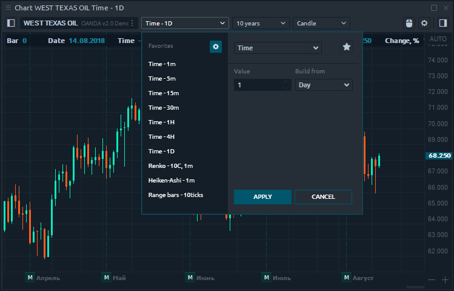
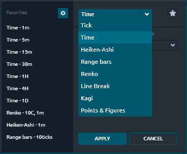

# Chart types

Quantower offers a variety of chart types to help you display chart data in different formats. You can change chart type from _**Aggregation type**_ menu as shown below.

### Chart types and styles

Quantower provides 8 chart types:

* Tick chart
* Time chart
* Heiken-Ashi
* Range Bars
* Renko
* Line Break
* Kagi
* Points & Figures

Charts can also be represented in 5 different styles:

* Candle
* Bar
* Line
* Dotted Line
* Area

