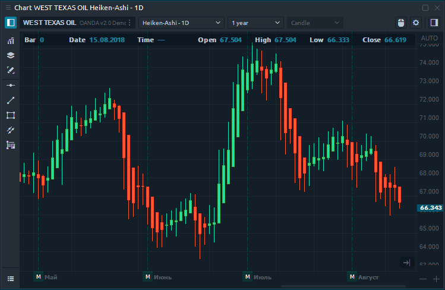
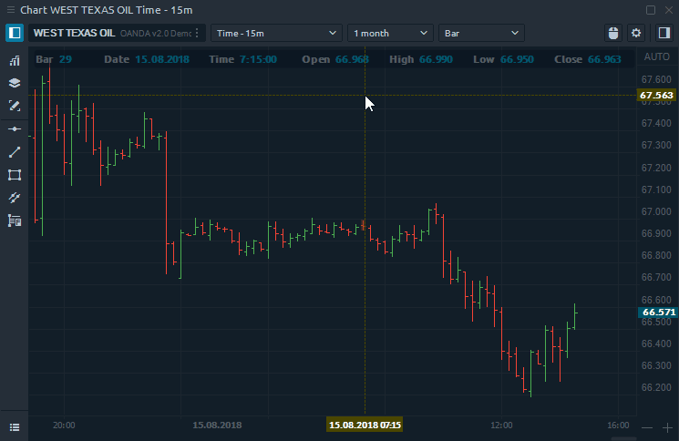

# Heiken Ashi

### General info

Heiken-Ashi chart \(HA\) is a modified type of classic candlestick chart, which is based on recalculation of OHLC data. The resulting candlestick filters out some noise in an effort to better capture the trend and reversal points.

The following calculations are used to construct the HA chart:

* HA Close = \(O+H+L+C\)/4
* HA Open = \(HA Open \(previous bar\) + HA Close\(previous bar\)\)/2
* HA High = Maximum \(H, HA Open, HA Close\)
* HA Low = Minimum \(L, HA Open, HA Close\)

### Creation a new Heiken-Ashi chart

To open a new HA chart, you need to select Heiken-Ashi from the drop-down list of aggregations and specify the build parameters - _**Value**_ and _**Build from**_. Click **\[ Apply \]** and the chart will be built. If the number of candles \(data\) is not enough, then choose a greater depth of history, for example 1 year or 5 years.

You can create several predefined settings to quickly build HA charts. To do this, you need to configure the parameters and _**Add to favorites**_ by pressing the Star icon.


Heiken-Ashi is used only with the Candle chart style.


