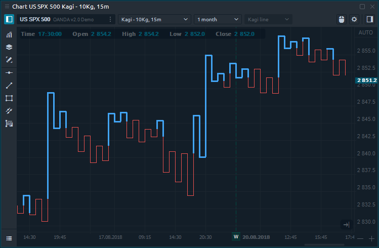
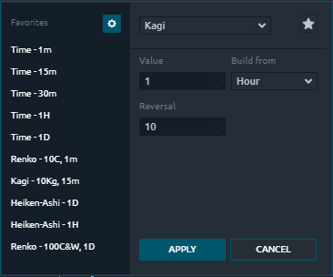

# Kagi

### General info

As P & F chart and Range bars, **Kagi chart** is full time-independent and based on price action only. Kagi chart consist of vertical lines that connected by horizontal lines.

### Kagi chart calculation

There are two main parameters that affects on Kagi chart:

* **Built from and its value**  — it's a parameter on the basis of which the chart will be print. If you set the 5 minute so the closing prices are taken from the 5-minute close.
* **Reversal**  — the amount of price movement that required for the Kagi line to reverse direction. For instance, if you'll set 10 ticks for the reversal parameter it means that price need to change at least 10 ticks to print reversal line.

