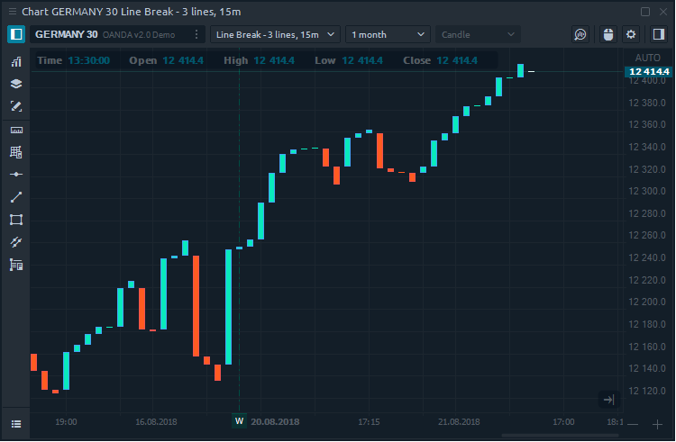
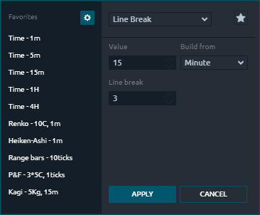
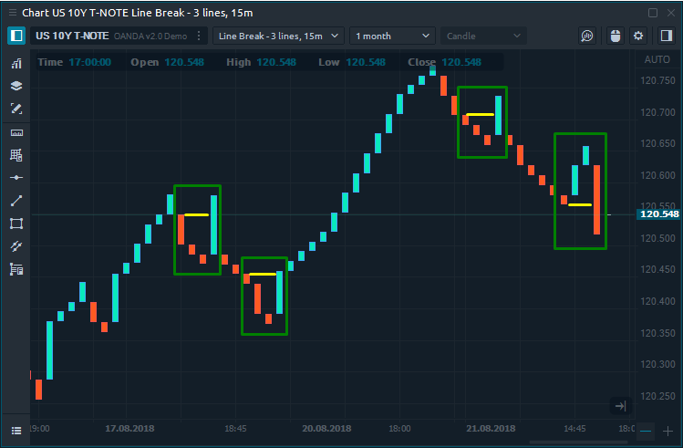

# Line break

### General info

**Line Break** is quite similar to other time-independent charts like Kagi, P & F, Range Bars. Line break chart prints the series of bars which represent increasing and falling prices. The key parameter that participates in the chart plotting is the number of the last bars for building the current bar.

It is important to note that the bars on this chart are usually called "lines". Line Break based on closing prices so it takes the current price and compares it with the closing prices of the previous bars \(lines\). The number of the previous bars that participate in the calculation specified in the chart settings.

### Line Break calculation

The most common number of Line Break setting is 3. It means that the closing price of the current line is compared to the closing price of the third line ago. 

Each new closing price has three possible outcomes:

* a new line with the same color  — build when the price goes in the same direction.
* a new line with the opposite color — build when the price change is enough to warrant a reversal. 
* no new lines are added when the price does not extend the trend or the change is not enough to warrant a reversal.

In the example above shows areas where the line color was changed. The yellow line shows the level of the third bar, when it breaks, the line color changes.

