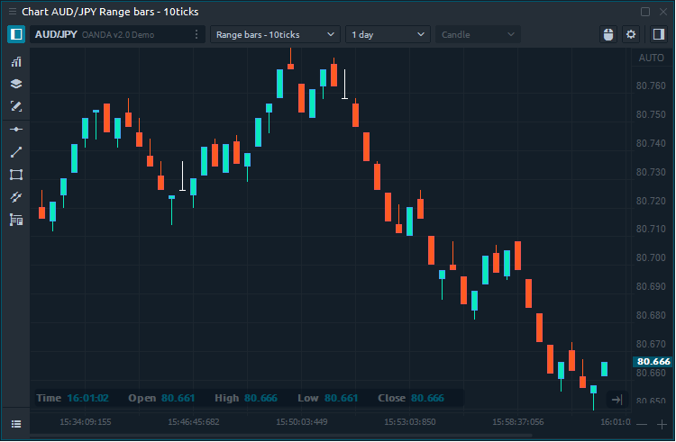

# Range bars

### General info

**Range Bars** chart consists of bars \(candles\) within a certain range, which is determined by the trader in the chart settings. Range Bars does not depend on time, but only on price movement. Thus, if the price has low volatility and stays in a range that is less than specified in the parameters, then new bars \(candles\) will not be built. Hence, the higher volatility of the trading instrument the more bars will be built;  conversely, during periods of lower volatility, fewer bars will be built.

### Calculation of Range Bars

To built range bars there are three simple rules:

* Each range bar must have a high/low range that equals the specified range.
* Every new range bar must open outside the high/low range of the previous bar.
* Each range bar must close at either its high or its low.

