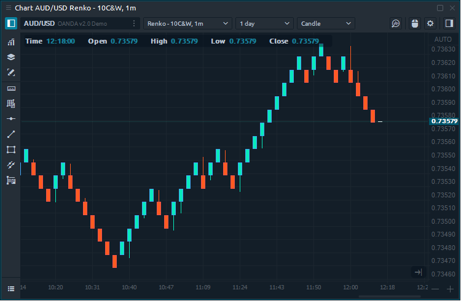
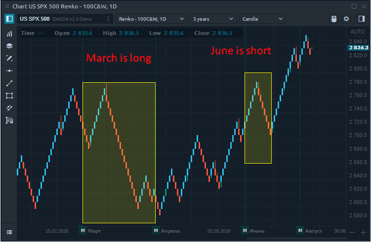
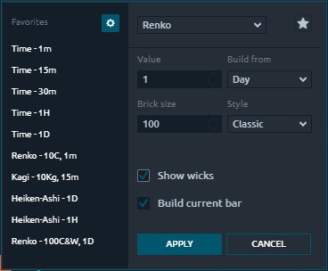
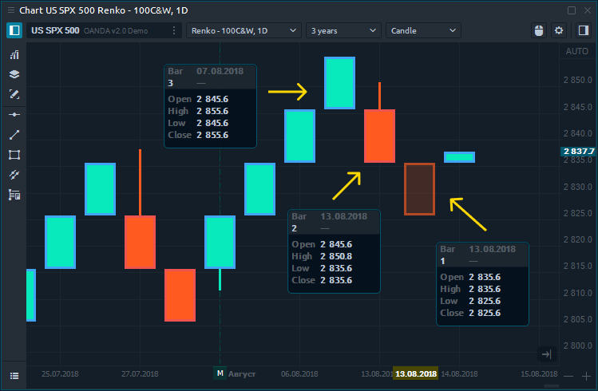
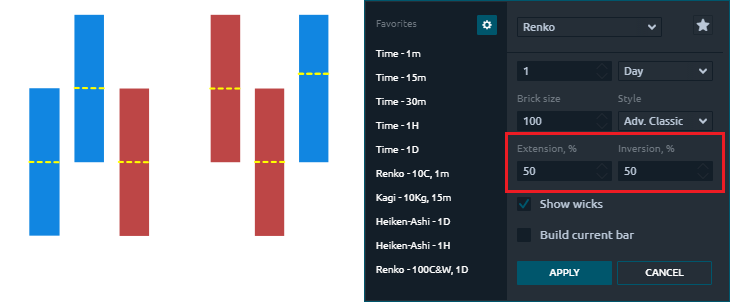
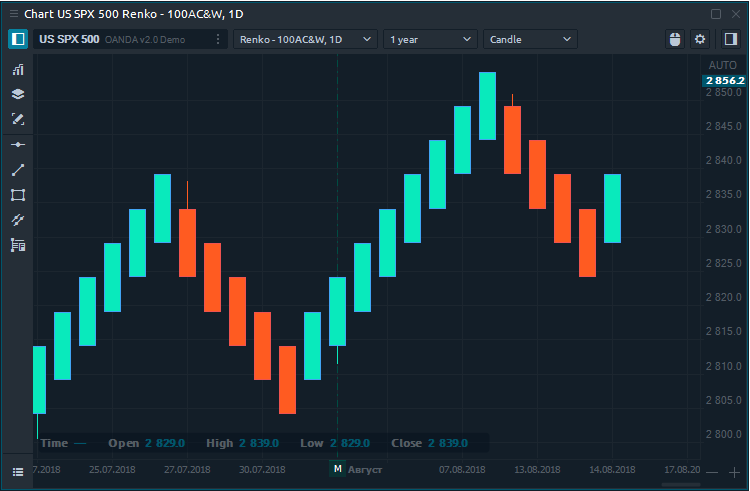
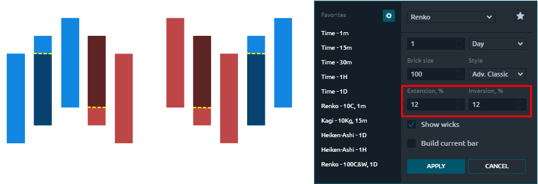
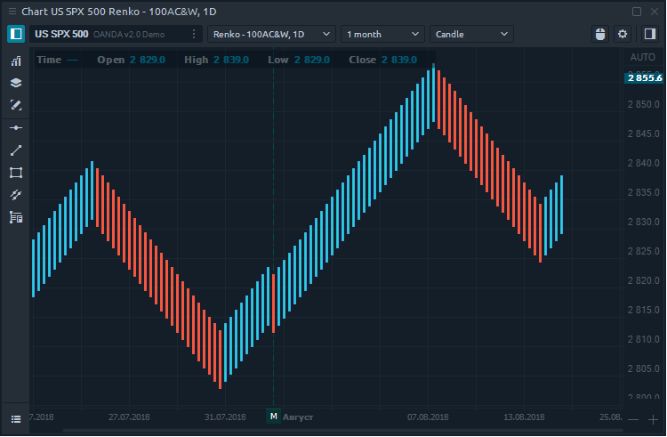
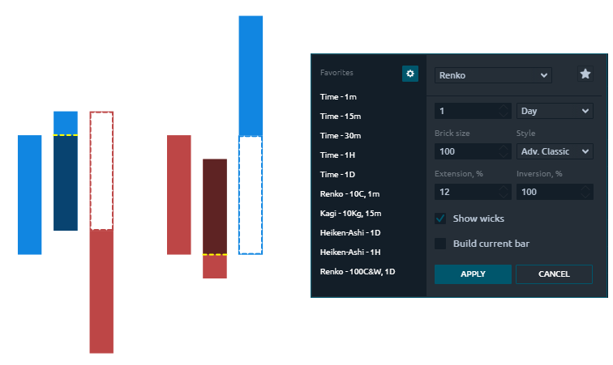
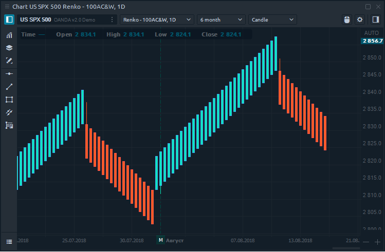

# Renko

### General info

Renko chart is completely time-independent, based on price movement only and help filter out the noise that can occur on other chart types. Renko is built from bricks, which are created only when the price exceeds the body of the previous brick by a certain size, which is set by the trader in the chart parameters.

### Renko chart calculation

The construction of the Renko chart is based on bricks, the size of which is set up by the trader. Thanks to this, the Renko chart ignores the time and focuses on price changes only. For example, by setting Brick size 10 points, the new brick will be built when the price is reaching out 10 or more points. Otherwise, the price of the Renko chart will not change.

* If there is an up brick before and the price will go up another 10 pips, a new up brick is be created
* If there is a down brick before and the price will go down another 10 pips, a new down brick is created
* If there is an up brick before, price needs to go down 20 pips, to create a new down brick
* If there is a down brick before, price needs to go up 20 pips, to create a new up brick

### Calculation styles \(methods\)

In the Renko chart settings, you can choose one of several styles based on which the chart will be drawn:

* **Classic**  —  using closing price \(or last price\) only

* **High / Low**  — using high and low prices. If the previous brick was growing, then the current brick takes into account high prices first, and then low prices. If the price drops, the method takes into account the low prices first, and then high prices.
* **Advanced Classic \(Advanced High / Low\)** — this method allows you to build non-standard Renko charts based on the closing price \(or high / low prices\). To do this, use additional chart settings —

  _extension_ \(%\) and _inversion_ \(%\).

* **Show wicks** — allows you to add wicks to Renko bricks, indicating actual highs and lows within a brick.
* **Build current bar** — is the option that shows/visualize the creation of the current brick in real-time. If you choose one minute for your time aggregation, all Renko bricks, that would have been created based on price movement, will be plotted at once after one minute.

### Non-standard Renko charts

**Medium Renko** smoothes out the chart more than Classic Renko because an open price is in the middle of a brick. They will show fewer pullbacks and trend reversals are easier to spot. An _extension and inversion value of 50%_ would create Median Renko bricks.

**Geometric Renko** will give you very smooth reversals, and the charts are smooth out more than with Median Renko.  One special property of these Renko form is, that when using an _extension and inversion percentage of 12.5%_, the slope of up-bricks will be 45° and for down bricks -45°

**Turbo Renko** smooths out the majority of pullbacks and only shows high probability reversals. Turbo Renko is using the _extension 12%_ of the brick and the _inversion of 100%._ Price has to reverse by a complete brick to form a reversal, illustrated as the dashed bricks.

