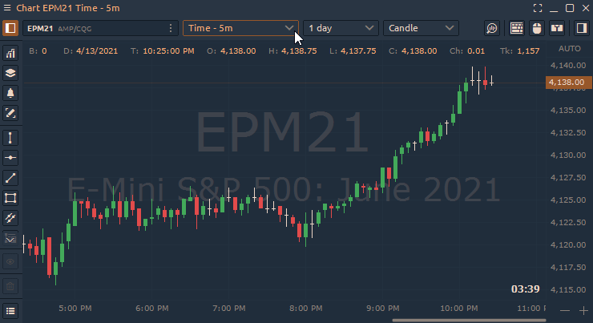

# Tick chart

Tick ​​Chart builds a new bar after a set number of trades, for example after every 610 trades. Basic charts \(like time-based\) draw a new bar after a set period of time, for example after every 5 minutes or hours.

For example, each bar of a 610 tick chart represents 610 trades of any size. A tick can be a trade of just one contract, or 10,000 contracts. This is why it’s crucial to combine the use of tick charts with volume.

To set this chart type, open TimeFrame Selector and select in the drop-down menu — **Tick**.

