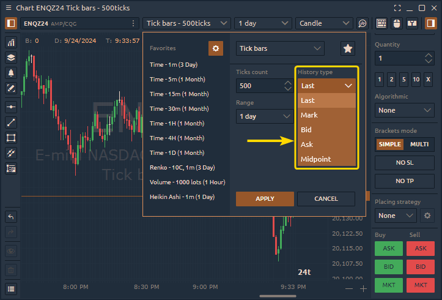

# Tick Bars

Tick ​Bars ​build a new bar after a set number of trades, for example after every 500 trades. Basic charts (like time-based) draw a new bar after a set period of time, for example after every 5 minutes or hours.

For example, each bar of a 500-tick chart represents 500 trades of any size. A tick can be a trade of just one contract, or 10,000 contracts. This is why it’s crucial to combine the use of tick charts with volume.

<figure><figcaption></figcaption></figure>

To set this chart type, open TimeFrame Selector and select in the drop-down menu — **Tick Bars**.

<figure><figcaption>
Tick Bars in Quantower platform
</figcaption></figure>

Depending on the type of instrument (Futures, Crypto, or Forex/CFD), the user can select the required data type for constructing tick bars.

<figure><figcaption></figcaption></figure>

