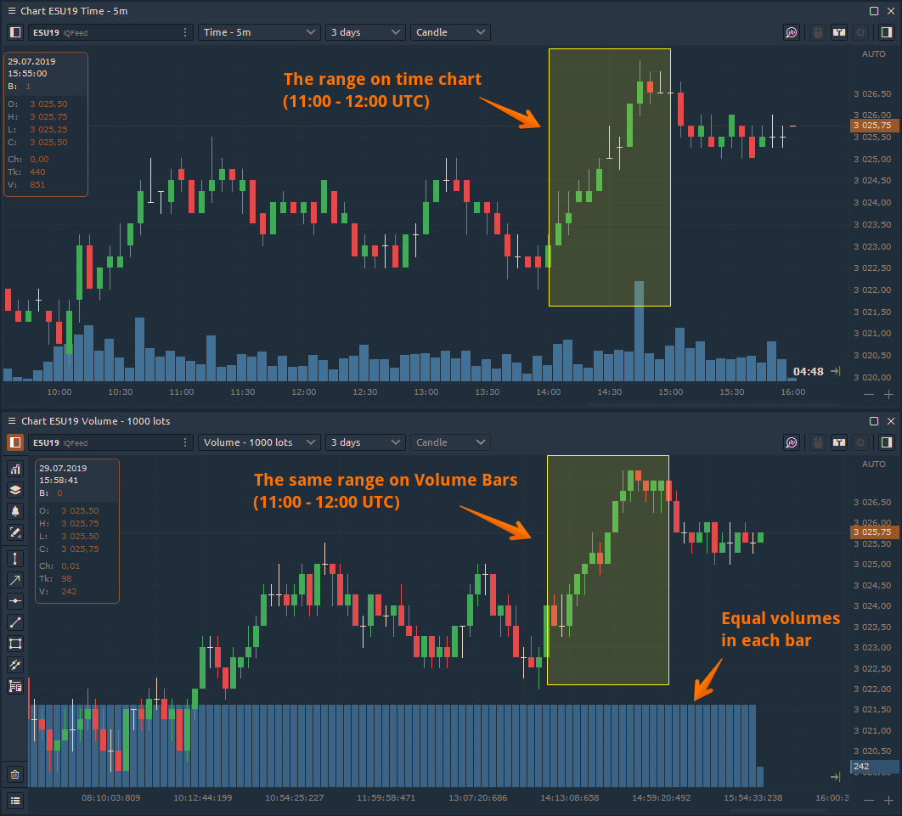
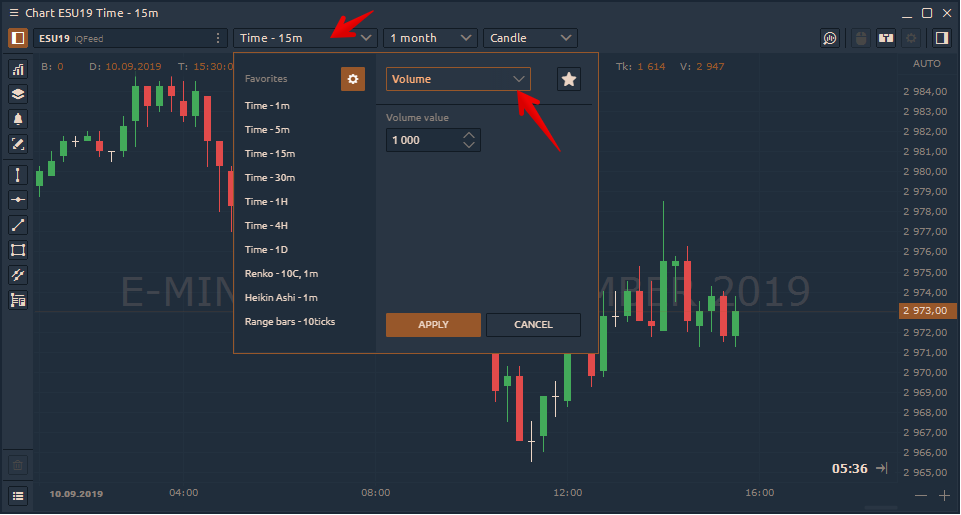

# Volume Bars

**Volume Bars** are built based on volume data — tick or exchange volume when available. Time is not involved in this aggregation. 

Each bar in a Volume Bar chart contains a specified volume level. This volume level is reached by accumulating the volume of each of the underlying bars. When the volume level is reached, the next Volume Bar begins to accumulate volume from the underlying bars.

### How to set Volume Bars chart?

Open the Timeframe switcher and select from the list the Volume Bars chart type. Set the necessary value of lots \(or ticks\) that will be included in each bar \(candle\).

