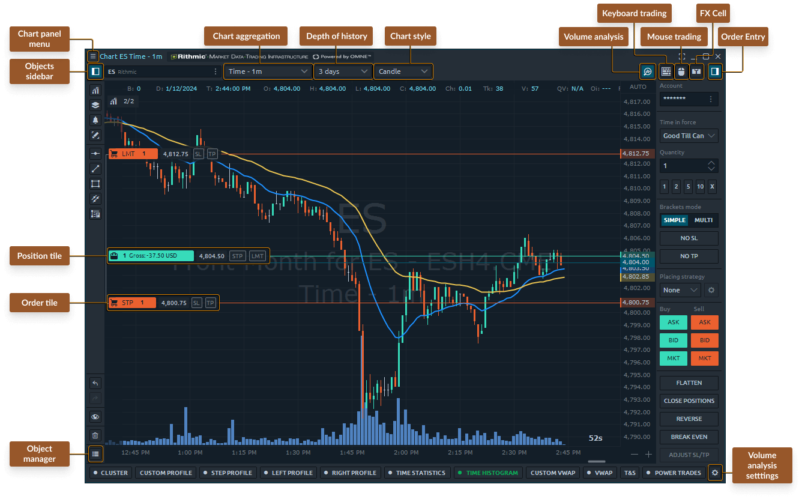

# Chart Overview

The chart panel is one of the most important panel for an active trader. Accurate market data, graphical and analytical tools are integral components of the panel, which allow you to make the right trading decisions.

<figure><figcaption>
Main parts of Chart panel in Quantower
</figcaption></figure>

The chart panel can be divided into 5 parts:

* Chart [**Top toolbar**](./#chart-top-toolbar) with the main controls (timeframes, depth of history, chart styles)
* **the chart area** itself with the displaying of price data, indicators, positions
* [**sidebar menu**](./#sidebar-menu-or-object-toolbar) with controls of indicators, drawings, overlays and object manager
* **chart order entry** with hot buttons for quick trading
* bottom toolbar with [**volume analysis tools**](volume-analysis-tools/)

## Chart Top toolbar

The top toolbar allows you to select a trading instrument, set the chart type and style, timeframe, depth of market data as well as call additional toolbars.

* Sidebar menu with [**Drawing tools**](drawing-tools.md), [**Overlays**](chart-overlays.md) and [**Indicators**](technical-indicators/)
* [**Symbol Lookup**](../../general-settings/instruments-lookup.md) where you can find the trading symbol from the list
* **Timeframe selector** with chart types. Here is the list of [**chart types and styles**](https://help.quantower.com/analytics-panels/chart/chart-types) where you can find a detailed explanation of how to build them.
* **Depth of History** for the selected timeframe
* **Chart Styles** — Bar, Candle, Line, Area, Dotted Line, Quantower chart style
* [**Volume Analysis Tools**](volume-analysis-tools/) — activates the volume analysis tool management menu at the bottom of the chart panel
* **Keyboard Trading mode** — activates the keyboard trading mode for quick trading. You can change trading hotkeys in the chart settings
* **Mouse Trading mode** for placing orders via chart area using the mouse.
* **Quick Order Entry** with Best Bid & Offer (Ask) prices where you can place orders or open a new position by the market price
* **Sidebar Order Entry with Trading Buttons** where you can set Order Quantity, TIF for different order types

.png>)

## Chart area controls

The main part of the Chart panel that contains the diagram itself plus a set of analytical overlays. There are some common controls on a chart area as follows:

* Price scale centering mode. There are four modes of price scale adaptation:
  * &#x20;<mark style="background-color:blue;">**Auto**</mark>** ** - keeps the visible part of chart diagram in viewport
  * &#x20;<mark style="background-color:blue;">**Auto centered**</mark> - the same as auto, but the last price is always in the middle of the viewport
  * &#x20;<mark style="background-color:blue;">**Keep in view**</mark> - keeps the last price from leaving the viewport
  * &#x20;<mark style="background-color:blue;">**Manual**</mark> - no automation, keeps the user's specified position

Once you drag the chart diagram within the viewport, the price scale mode changes to Manual. Right-click on the price scale to access all available options.

<mark style="color:green;">**Time to the next bar**</mark> shows the time remaining until the next bar appears.

The "<mark style="color:green;">**Snap to Last**</mark>" button only appears when you have scrolled your chart time to the left (past history). It lets you quickly scroll your viewport to the very last bar and snap time scrolling to every last bar that will appear in the future. The margin between the last bar and the Price scale can be adjusted in the chart settings.

<figure><figcaption>
Chart area common controls
</figcaption></figure>

## Sidebar menu with Drawings, Indicators, Overlays

The sidebar menu allows you to add an indicator to the chart, a drawing tool or an overlay, and also manage all objects through the object manager.

For traders who often refer to certain drawings, there is an option to fix them on the Sidebar. For this, near each drawing there is a "Star" icon, upon activation of which you add them to the Favorite List.

