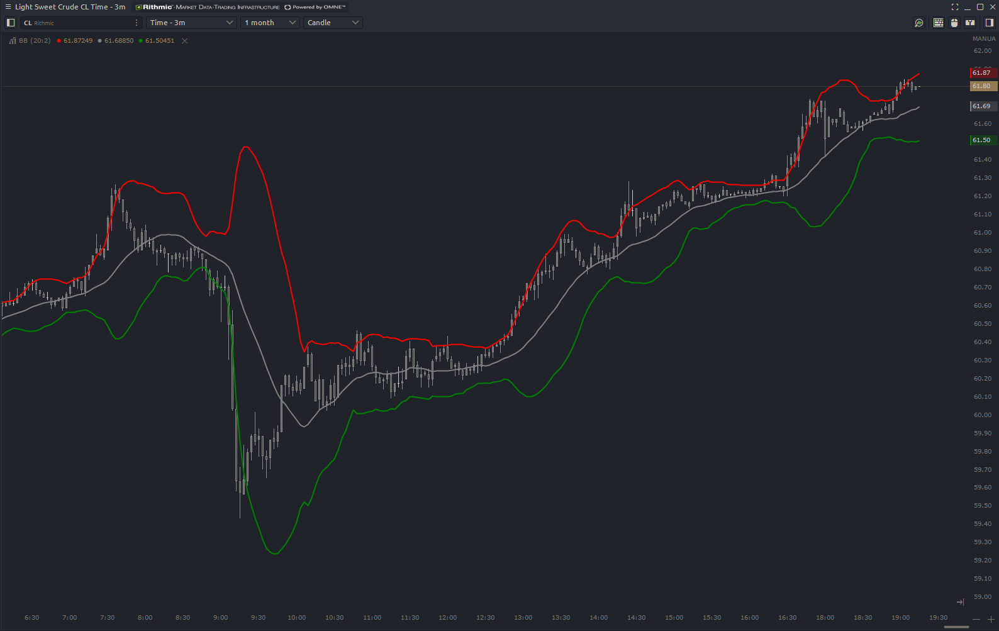

# Bollinger Bands

Bollinger Bands consider prices and volatility over time of a financial instrument or commodity, using a formulaic method propounded by John Bollinger in the 1980s.

### Input Parameters
**Period of MA for envelopes** - Number of bars to use to calculate the moving average envelope.

**Value of confidence interval** - Standard deviation of price movement and volatility. 

**Sources prices for MA** - Input for the moving average.

**Type of moving average** - Defines the type of moving average calculation used for the overall equation.

**Calculation Type** - Use all data in the rendered chart or just the defined n bars in period. 