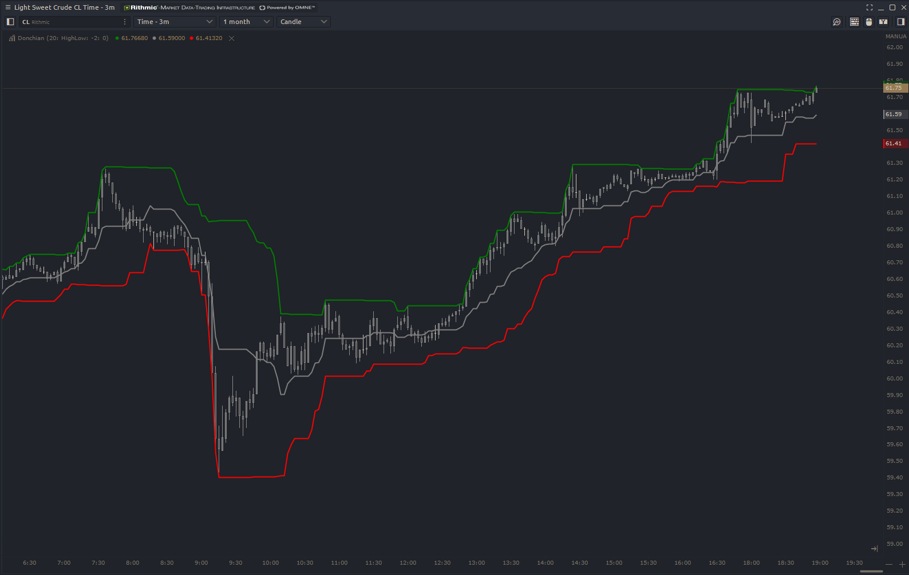

# Donchian Channel

The Donchian channel is an indicator used in market trading developed by Richard Donchian. It is formed by taking the highest high and the lowest low of the last n periods. The area between the high and the low is the channel for the period chosen.

### Input Parameters
**Period** - Number of bars to use when calcuating n period high and low.

**Extremes** - Change from using the traditionally high-low calcuation for the extremes to any of the other options.

**Period** - Number of bars to use when calcuating n period high and low.

**Margins** - TBD

**Shift** - Number of bars to shift the indicator forward. 