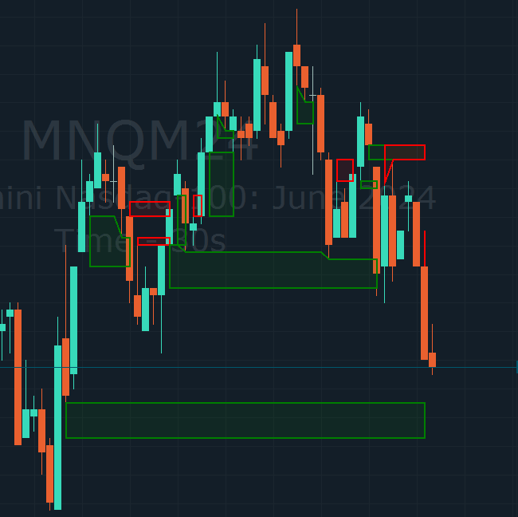
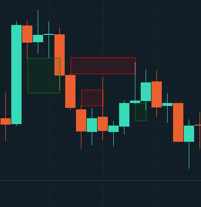
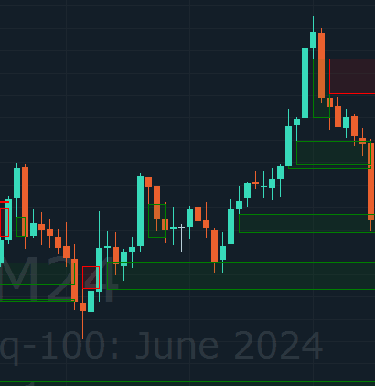

# Fair Value Gap (FVG)

Fair Value Gap (FVG) is an indicator used by traders to identify imbalances and inefficiencies in the market. It is based on the concept that after a sharp price movement that leaves a price gap on the chart, the market tends to fill the gap.

Our indicator automatically finds and displays the FVG on the chart.

### Traders can deeply customise the parameters of the indicator:

#### **Close gap partially**

If this function is activated, levels will not close after they are covered.

By default, the function is disabled and when the marked level is reached, it closes.

<figure><figcaption></figcaption></figure>

#### **Expand Gaps**

The function covers the candle's imbalance for a clearer representation.

**Same Direction Requested**

When this function is selected, the FVG is only displayed in one direction. Opposite FVGs will be displayed on the chart, but only the patterns from the formed 3 candlesticks will be marked.

<figure><figcaption></figcaption></figure>

#### **Direction type**

_Up and Down -_ Standard FVGs display, both ways.&#x20;

_Only Up -_ FVGs display, only in the buyer's direction

_Only Down -_ FVGs display, only in the sales direction

#### **Max number gaps**

Display the specified number of gaps on the chart history

#### **Minimal Deviation**

Sort by minimum gap size, to filter out minimum values.

If the value is equal to 0%, no filtering is performed. The maximum default value is 100%. A value greater than 0% filters gaps up to 100%.

#### **Maximal Deviation**

Sort by maximum gap size, to filter out maximum values.

If the value is equal to 100%, no filtering is performed. The maximum default value is 100%. Values below 100% are filtered out gaps.

#### **Up Color**

Color selection for the Up Gaps.

#### **Down Color**

Color selection for the Down Gaps.

#### **Draw Borders**

Visually color-coding the gaps

Also visual customization: color selection and stroke style

#### **Draw Half Line**

Display of 50% gap level

Also visual customization: color selection and stroke style

<figure><figcaption></figcaption></figure>

#### **Show Shrink**

Gap overlap When the imbalance level is touched, the gap will be considered met or not.

_Shrink always -_ The gap is extended after a price touchdown

_Close on percente -_ The gap closes when the percentage of overlap you select is reached, the screenshot shows an example of 50% overlap

_Close always -_ When the price touches the gap, gap is closes.

_No Shrink -_ The gap will close only if one candle closes the high low of the zone completely.

<figure><figcaption></figcaption></figure>

#### **Hide Closed**

Remove gaps that were worked off by price touch.

<figure><figcaption></figcaption></figure>
