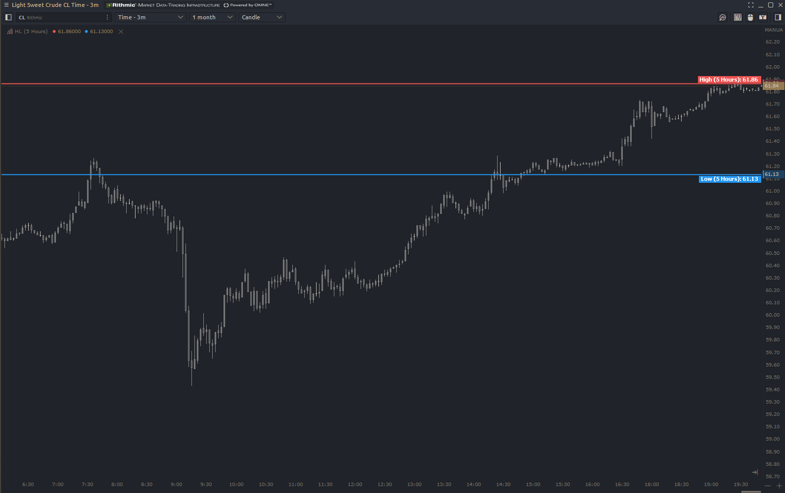

# High Low Indicator

This indicator marks the highes price and the lowest price of the instrument traded over _n_ periods.

### Input Parameters
**Range** -  Number of _n_ periods to look back.

**Period** - Timeperiod to look back _n_ amount and grab the high and low.
