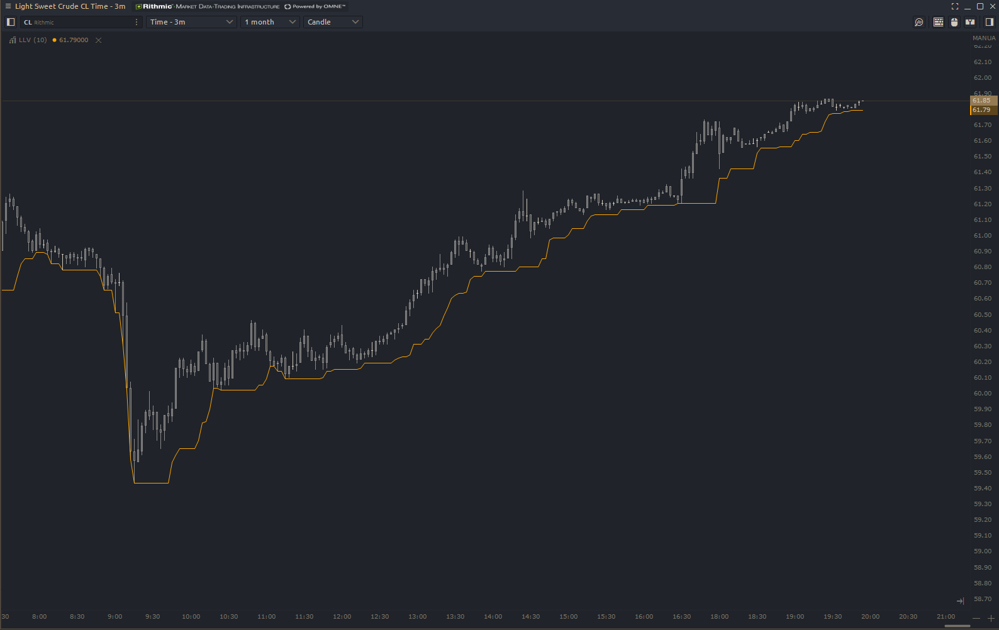

# Lowest Low

This indicator marks the lowest price the instrument traded over _n_ periods.

### Input Parameters
**Period** - Number of bars back to consider for calculating the lowest low.

Note: By default it appears as a sub window go to settings > view > position on chart to have it overlay the main price chart.