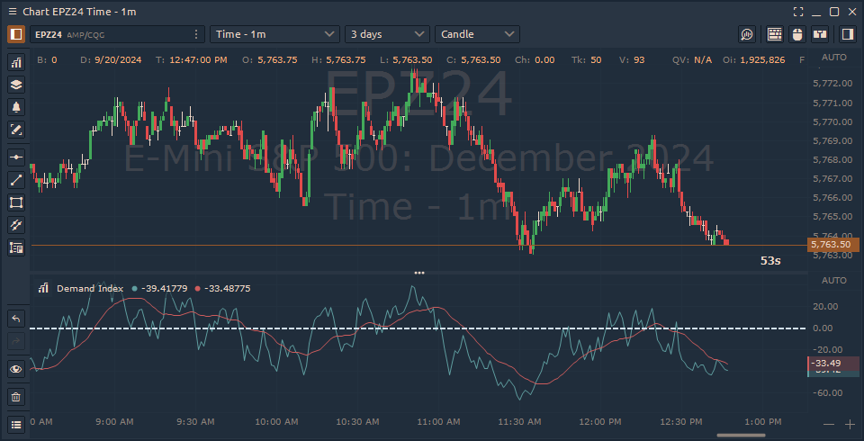

# Demand Index

Developed by James Sibbet, this indicator is often seen as a leading signal of future price changes. Sibbet outlined six key rules for interpreting the Demand Index, which are useful for traders looking to apply it effectively:

1. A divergence between the Demand Index and prices suggests a potential price reversal.
2. A high peak in the Demand Index often comes before new price highs.
3. When prices rise but the Demand Index falls, it usually indicates a market top.
4. The Demand Index crossing the zero line signals a change in trend.
5. If the Demand Index stays around zero, it shows weak price movement that likely won’t last.
6. A long-term divergence between the Demand Index and prices points to a major market top or bottom.

To improve the accuracy of their trades, traders should combine the Demand Index with other technical indicators and chart patterns.

<figure><figcaption>
Demand Index indicator in Quantower platform
</figcaption></figure>

