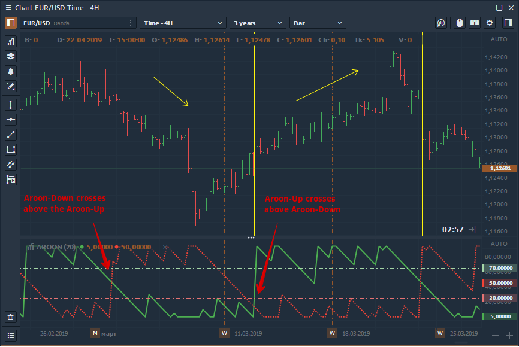

# Aroon Indicator

### What is Aroon Indicator?

The Aroon indicator, developed by Tushar Chande, indicates if a price is trending or is in a trading range. It can also reveal the beginning of a new trend, its strength and can help anticipate changes from trading ranges to trends. AroonDown and the AroonUp indicators are used together and combined are called the Aroon indicator.

**AroonUp** measures how long it has been since prices have recorded a **new high** within the specified period. If the current bar’s high is the highest within the user defined number of periods before it, then the AroonUp value is 100. In other words, it is a new high for the period. Otherwise it returns a percent value indicating the time since a new high occurred for the specified period.

**AroonDown** measures how long it has been since prices have recorded a **new low** within the specified period. If the current bar’s low is the lowest within the user defined number of periods before it, then the AroonDown value is 100. In other words, it is a new low for that period. Otherwise it returns a percent value indicating the time since the new low occurred for the specified period.

### How Aroon indicator works?

* If the Aroon-Up crosses above the Aroon-Down, then a new uptrend may start soon. Conversely, if Aroon-Down crosses above the Aroon-Up, then a new downtrend may start soon.

* When Aroon-Up reaches 100, a new uptrend may have begun. If it remains persistently between 70 and 100, and the Aroon-Down remains between 0 and 30, then a new uptrend is underway.
* When Aroon-Up and Aroon-Down move in parallel (horizontal, sloping up or down) with each other at roughly the same level, then price is range trading or consolidating.

### How is Aroon indicator calculated?

Aroon-Up = \[(Period Specified – Periods Since the Highest High within Period Specified) / Period Specified] x 100 \
Aroon-Down = \[(Period Specified – Periods Since the Lowest Low for Period Specified) / Period Specified] x 100
