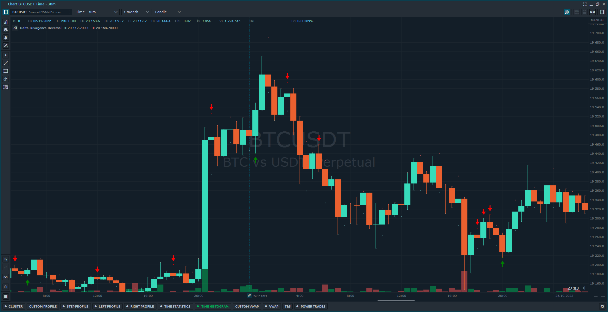

# Delta Divergence Reversal

**Signal when one of the following events occurs:**

1. a bar closes with a lower low and a lower high than the previous bar. And the delta is positive, give a BUY signal
2. a bar closes with a higher high and a higher low than the previous bar, AND the delta is negative, give a SELL signal

<figure><figcaption></figcaption></figure>
