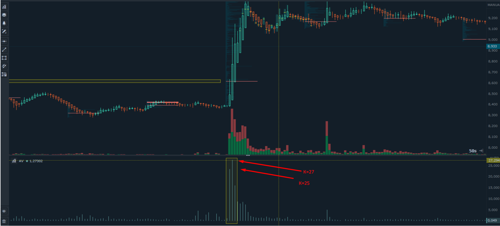
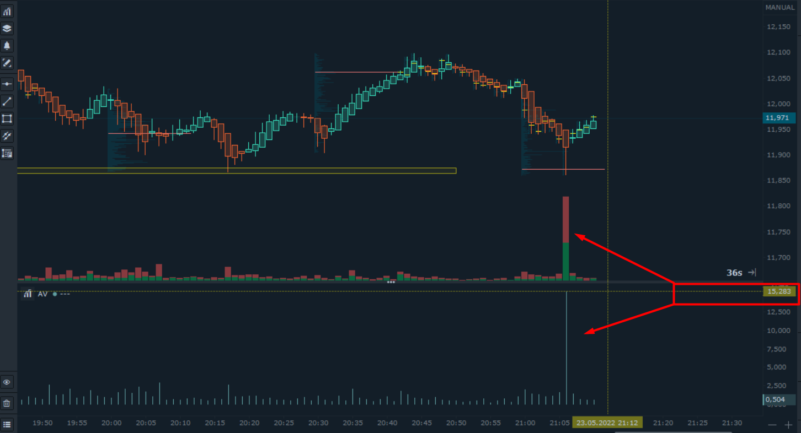
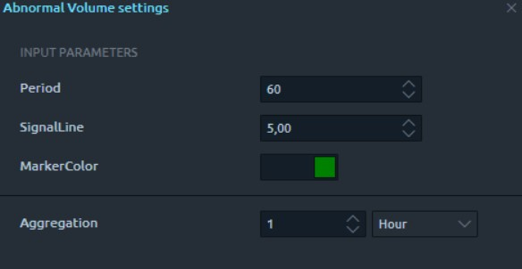
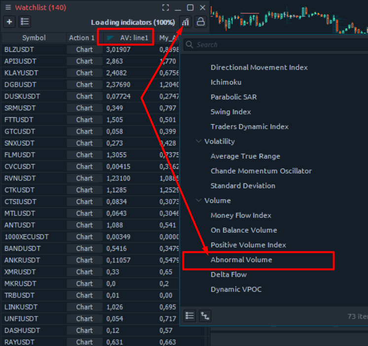
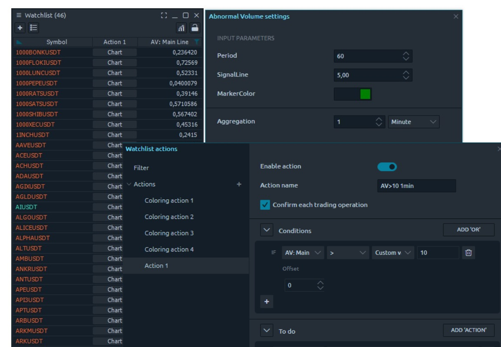
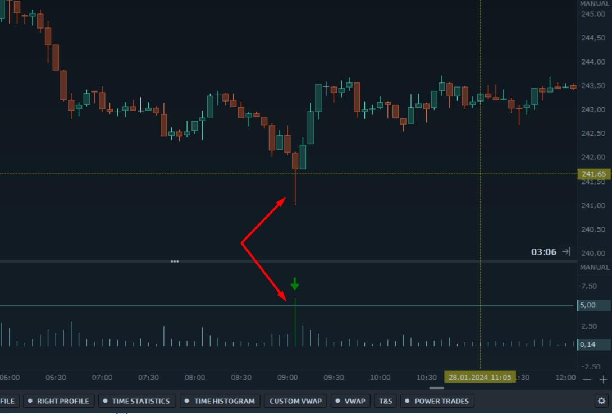
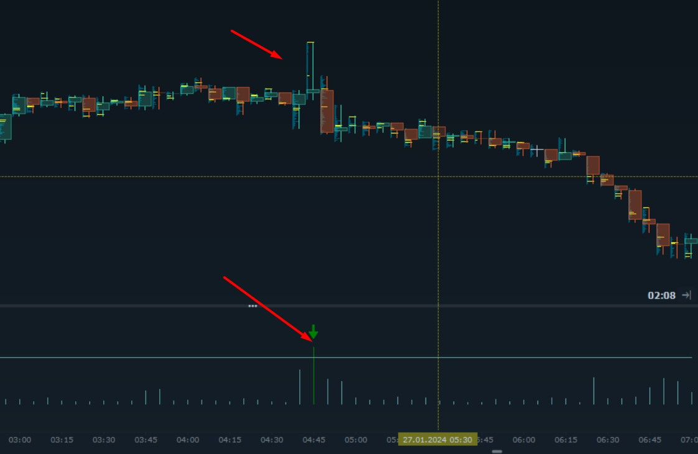

# Abnormal Volume

**Abnormal Volume** is available for addition to the watchlist, allowing for quick searching, sorting, and selection of instruments with high volume on any timeframe. The instrument search and selection are based on the ratio of the latest volume to the average volume over a specified period.

The indicator value ('K') shows by how many times the volume on the current candle exceeds the average value for the specified recent period.&#x20;

\
**The indicator value ('K') shows by how many times the volume on the current candle exceeds the average value for the specified recent period.**


**The coefficient is calculated in real-time, without waiting for the candle to close, providing the opportunity to react quickly when a large volume appears in the market.**


In different periods of market activity, the average volume over a period changes on the same instrument. The increased volume coefficient is not tied to quantity, sum, or coin. It is a relative value that allows for comparing, sorting, and selecting various instruments, taking into account the average volume specifically for that instrument over the specified period. This makes it usable not only on traditional financial instruments but also on cryptocurrencies.

_Peak, elevated, abnormal, reversal, breakthrough, and stopping_ – these are terms traders often use to describe very high volume relative to previous levels, depending on the market stage.

<figure><figcaption>
The occurrence of volume that is 25 times higher than the average volume over the past 60 candles.
</figcaption></figure>

Abnormal Volume is not a standalone trading strategy, but it is invaluable when combined with other signals to identify precise and profitable entry points in strategies that take into account increased or, conversely, decreased volume.

<figure><figcaption></figcaption></figure>

### The settings for Abnormal Volume when adding it to the watchlis

<figure><figcaption></figcaption></figure>


**In this example, the K coefficient of the Abnormal Volume indicator will be calculated in real-time, indicating how many times the volume on the last hourly candle is greater than the average volume of the last 60 hourly candles.**


**"Aggregation"** - the choice of timeframe for identifying abnormal volume;&#x20;

**"Period"** - the number of previous candles to compare with the average value.

Thus, it is possible to flexibly adjust both the comparison periods and the timeframes for identifying abnormal volume.

### Abnormal Volume in the watchlist.

To add Abnormal Volume to the watchlist and configure either sound alerts or messages, you need to select it from the provided list of built-in indicators.

<figure><figcaption></figcaption></figure>

If a trader in their strategy considers the average volume over a longer period, then abnormal volume may be defined as volume with **K=10** and above the average. In a short range of average values, the threshold for the abnormal volume coefficient may be less than **10**.

**К - Abnormal Volume** updates in real-time based on the data of the latest candle. Since the watchlist includes a shift parameter, it is possible to search for increased volume on the previous candle, the third one from the current moment, and so on. This provides advanced capabilities for finding patterns and trading formations.

### Examples of Abnormal Volume.

<figure><figcaption>
If the volume on the second-to-last 1-minute candle/bar exceeds the 60-minute average volume by 10 times, a sound alert and message/alert will be triggered
</figcaption></figure>

In this example, we are searching for increased volume on 1-minute candles. The watchlist displays K, indicating how many times the volume on the last minute exceeds the average volume of the last 60 candles. An alert condition has been added:

> If the volume on the second-to-last 1-minute candle/bar exceeds the 60-minute average volume by 10 times, a sound alert and message/alert will be triggered.

### Examples of Abnormal Volume on the chart.

Critical market situations, such as breaking out of accumulation zones, level breakthroughs, trend strengthening, are often accompanied by abnormal volumes with high TR (True Range).

For example, in conjunction with the TR% indicator, there is a **quick selection of aggressive candles** with high TR% **on high volume**. In most cases, such market aggression is associated with powerful impulsive movements, breakthroughs of levels, or accumulation zones.

If a trader's trading system involves a level breakout, the combination of two indicators, Abnormal Volume + TR%, can help quickly filter candles that are specifically breaking through accumulation zones or resistance levels.

<figure><figcaption></figcaption></figure>

High volume on a Pin Bar can be a good reversal point for the market or a temporary correction. A sufficiently high volume on a candle with a minimal body and a long shadow may suggest that further movement may not continue, indicating strong resistance. One of the well-performing patterns is a Pin Bar with abnormal volume on a lower timeframe, followed by a reversal in the direction of the trend on a higher timeframe.

<figure><figcaption></figcaption></figure>

 

<figure><figcaption></figcaption></figure>

Based on the above, the indicator itself is not a complete trading system, but with alerts, messages in a Telegram bot, and sound notifications regarding abnormal volume K, it addresses one of the important issues for traders – the quick identification of zones with abnormally high volumes. This helps traders avoid missing opportune moments to enter profitable positions according to their trading strategy.

