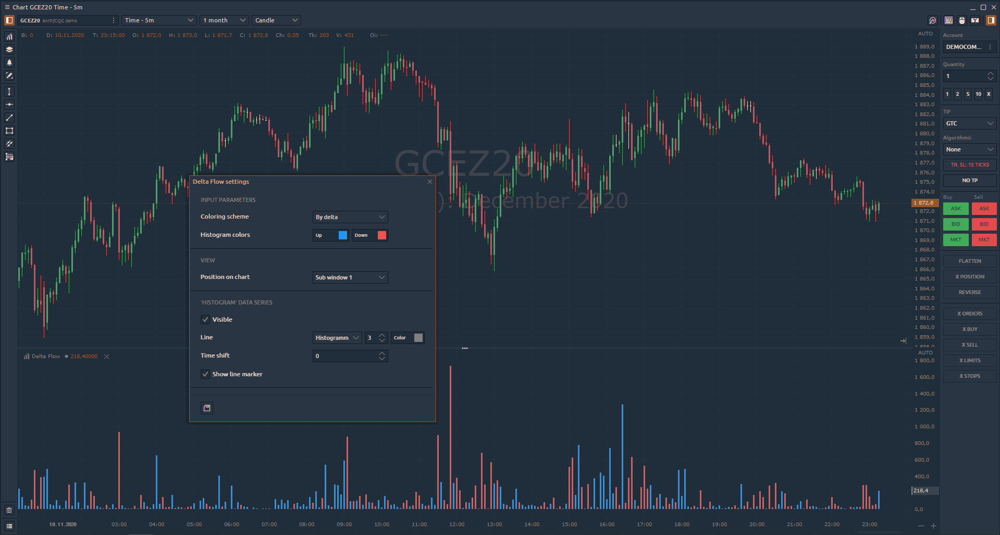
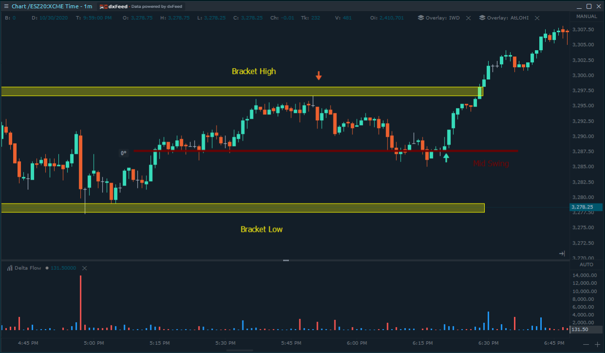

# Delta Flow

### Overview of Delta Flow indicator

**Delta Flow** calculates as Delta \* \(High - Low\) and describes the impact of the aggressive orders on the market price through Delta value.

In this example, the ESZ20 was ranging in a braket while showing clear activity around the Mid Swing.

As price approached the “Bracket High” area the market activity dropped showing a lack of follow through and went into a narrow ranging activity. Neither buyers nor seller in sight…

At some point Delta flow started to spot activity to the downside indicating a potential down-move ahead. This is our opportunity to go for a short.  SL  above the Bracket High, TP1 at Mid Swing, TP2 at Bracket Low.

On the down-move selling aggression steps further in allowing the price to reach TP1. 

On the last swing below the “Mid Swing”, the aggression vanished. At this stage, caution is advised.

As prices moves back above the “Mid Swing” significant aggression  steps in giving us the signal to close the rest of our order to flat.

At this stage, we can either step aside or reverse our trade into a long position. 

In the scenario of a long trade: SL below the last Swing low below the “Mid Swing”, TP1 Bracket High, TP2 above the Bracket as a runner.

As the TP1 gets hit, the narrative differs from the previous trade. Buying aggression is still present, allowing us to let the rest of the position to run further. At some stage, aggression steps in, giving us the signal to step out of the trade.

### Delta Flow Settings

Coloring Scheme:  
     **By delta** — bar color on the indicator corresponds to the color for positive or negative delta;  
     **By bar** — bar color on the indicator corresponds to the bar color on the chart \(up or down\).

