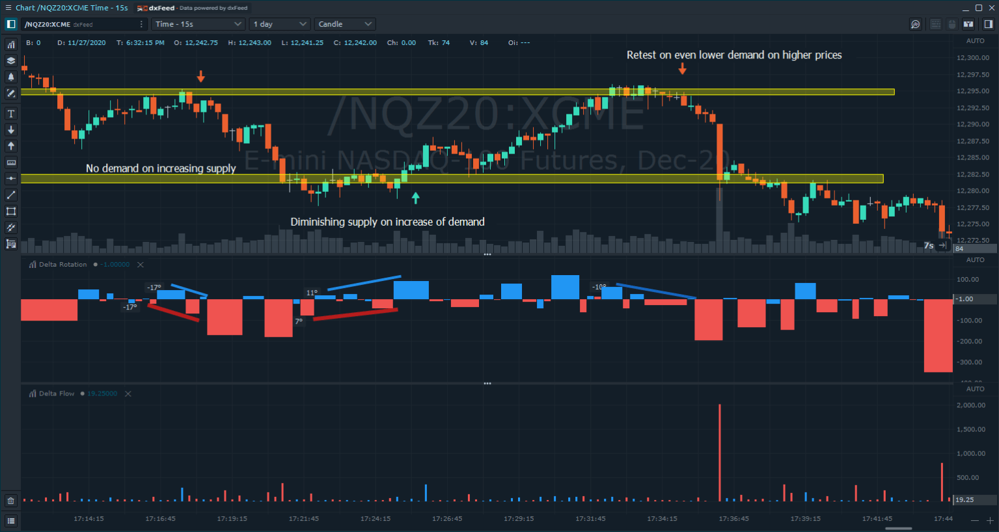
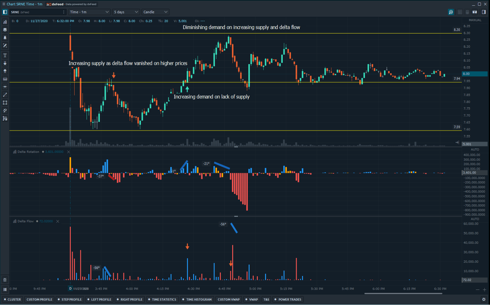
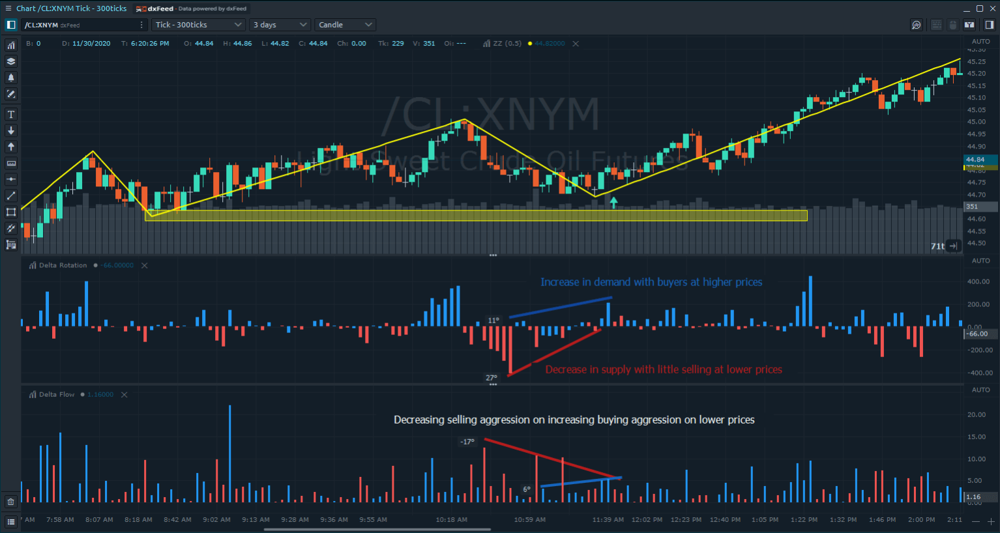
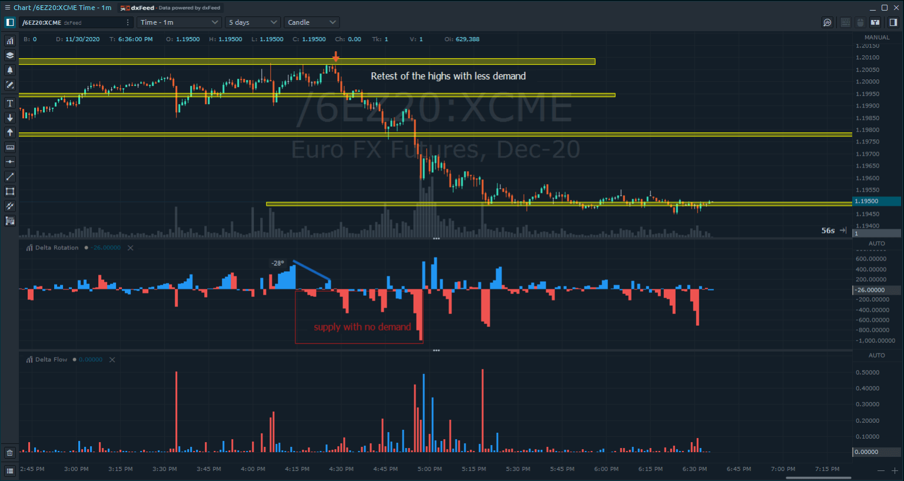

# Delta Rotation

Delta rotation describes the demand and supply per market rotation through Delta. This allows us to assess whether or not each price movement can be assigned with an increase of demand/supply or on the opposite on the diminishing supply and demand. 

The following examples cover different entry points from reference points based on supply and demand shifts

