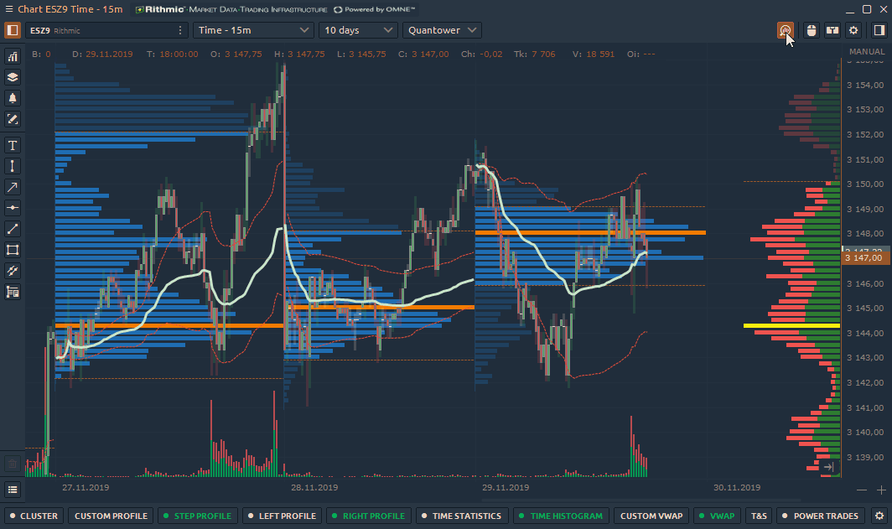
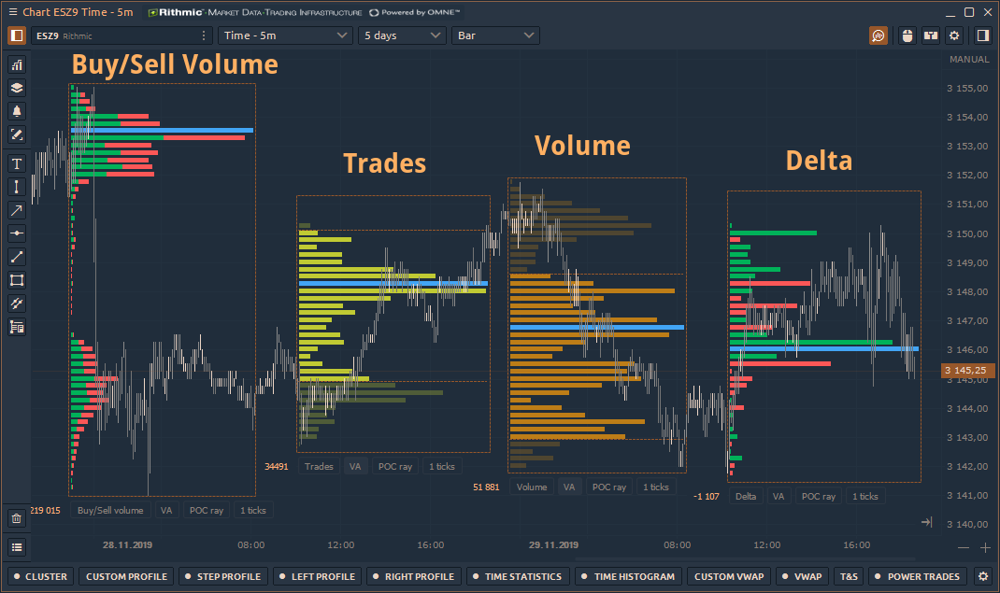

# Volume Analysis Tools \| Volume Profiles \| Footprint chart \| VWAP

Quantower trading platform provides [**Volume analysis tools**](https://www.quantower.com/volumeanalysistools), an advanced analytical functionality, which allows you to see the traded volume at each price level, assess the balance between buyers and sellers and understand the intentions of traders regarding the future price

Volume analysis tools include proprietary and well-known analytics:

* \*\*\*\*[**Cluster Chart**](https://help.quantower.com/analytics-panels/chart/volume-analysis-tools/cluster-chart) \(a.k.a. Footprint chart or OrderFlow chart\)
* [**Volume Profiles**](https://help.quantower.com/analytics-panels/chart/volume-analysis-tools/volume-profiles) — Step, Right, Left and Custom volume profiles
* [**Time Statistics**](https://help.quantower.com/analytics-panels/chart/volume-analysis-tools/time-statistics) — volume data per each bar in table form
* [**Time Histogram**](https://help.quantower.com/analytics-panels/chart/volume-analysis-tools/time-histogram) ****— volume data per each bar in the form of a vertical histogram
* \*\*\*\*[**Custom VWAP \(Anchored VWAP\)**](../anchored-vwap.md) — can be attached to any selected bar as a starting calculation point
* \*\*\*\*[**VWAP**](../vwap.md) — multiple VWAP lines for a single chart
* [**Historical Time & Sales**](https://help.quantower.com/analytics-panels/chart/volume-analysis-tools/historical-time-and-sales) ****— the table of all trades for the any selected bar



 The GIF below shows how you can activate the toolbar of volume analysis tools:


**Green color** indicates that seleced volume analysis tool has entirely downloaded the data.   
**Yellow color** indicates that selected tool is dowloading the data.


### Data types of Volume Analysis Tools

Almost all volume analysis tools have the same **Data Types**, which can be specified in the settings:

* **Trades** — it's the number of contracts \(trades\) that executed at each price level.
* **Buy \(or Sell\) trades** — it's the number of Buy \(or Sell\) trades that executed at each price level.
* **Volume** — the total size of all positions that executed at each price level or price range.
* **Buy \(or Sell\) Volume** — the total size of all Buy \(or sell\) positions that executed at each price level or price range.
* **Buy \(or Sell\) Volume, %** — shows how many percent of the total volume relates to Buy \(or Sell\) trades
* **Buy / Sell Volume** — simultaneous display of buy and sell volume on one histogram
* **Delta and Delta %** — shows the difference in traded Volume between Buyers and Sellers. It allows evaluating who controls the price on the market at a given time.  Delta % = Delta / Volume \* 100
* **Cumulative Delta** — the data is built by adding the current delta value with each subsequent delta value for the certain period of time \(or number of bars\). 

* **Average size** — the average volume of the position that was executed at a certain price or price range.
* **Average Buy size** — the average volume of a Buy position that was executed at a specific price or price range.
* **Average Sell size** — the average volume of a Sell position that was executed at a specific price or price range.
* **Max one trade volume \(value and %\)** — shows the maximum volume of a single trade that has executed at a certain price or price range \(depending on the Custom Step \(ticks\) setting\).
* **Filtered volume \(value and %\)** — this parameter displays volumes that exceed the size specified in the filter. If the volume size is smaller than the one specified in the filter, then the values will be zero.
* **Buy \(or Sell\) filtered volume** — the parameter displays Buy \(or Sell\) volumes that exceed the size specified in the filter.

