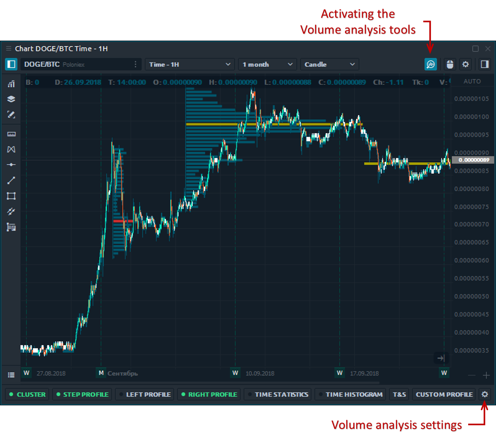

# Volume analysis tools

Quantower trading platform provides **Volume analysis tools**, an advanced analytical functionality, which allows you to see the traded volume at each price level, assess the balance between buyers and sellers and understand the intentions of traders regarding the future price.

Volume analysis tools include proprietary and well-known analytics, which we’ll explore in the further articles:

* [Cluster chart](https://help.quantower.com/analytics-panels/chart/volume-analysis-tools/cluster-chart) \(or Footprint chart\)
* [Set of volume profiles](https://help.quantower.com/analytics-panels/chart/volume-analysis-tools/volume-profiles) - Step, Right, Left and Custom volume profiles
* [Time Statistics](https://help.quantower.com/analytics-panels/chart/volume-analysis-tools/time-statistics) \(known as Bar Statistics\)
* [Time Histogram](https://help.quantower.com/analytics-panels/chart/volume-analysis-tools/time-histogram)
* [Historical Time & Sales](https://help.quantower.com/analytics-panels/chart/volume-analysis-tools/historical-time-and-sales)

 The screenshot below shows how you can activate the toolbar of volume analysis tools:


Green shows enabled volume analysis tools that have entirely downloaded data.   
Yellow shows tools that enabled but the data for their work is loaded.


  

