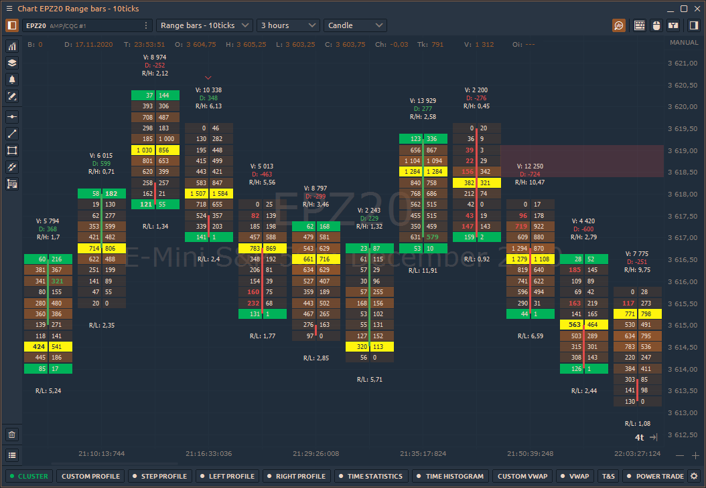
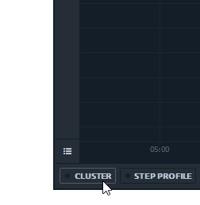
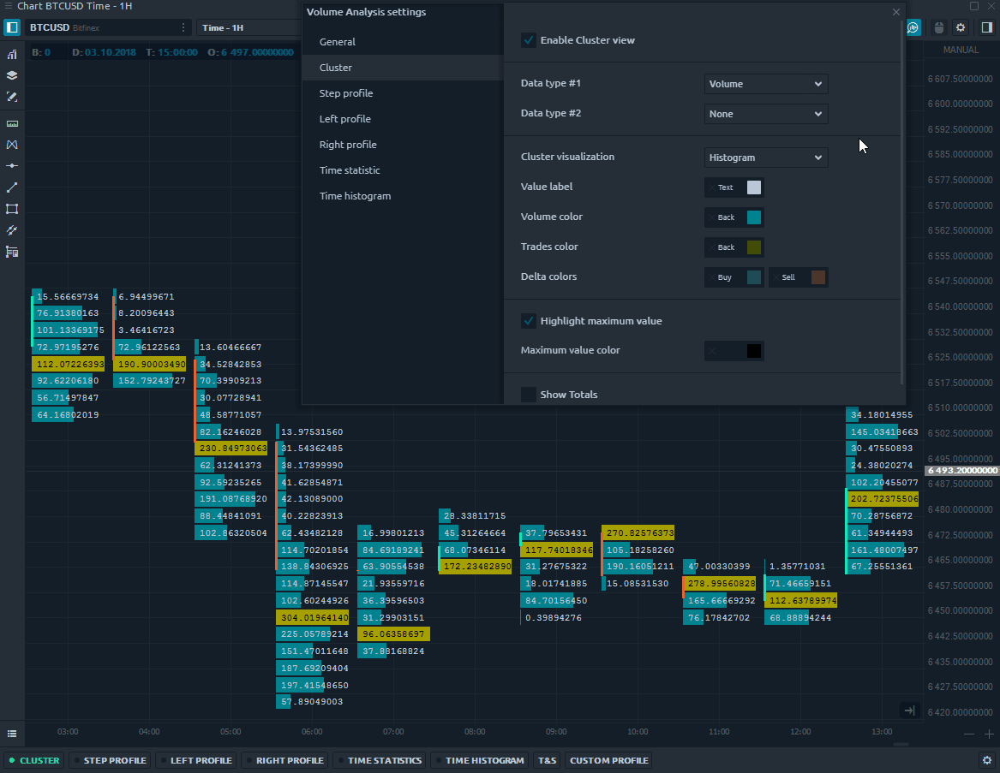
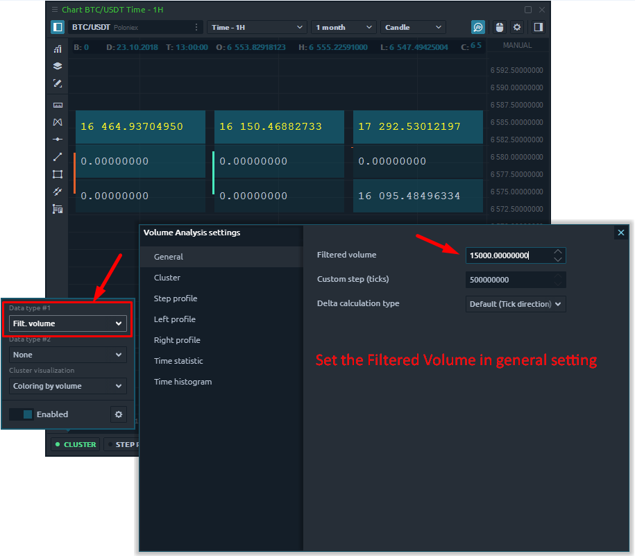

# Cluster chart



### What is Cluster chart?

**Cluster chart**, known as Footprint chart in other trading platforms, is an advanced chart type that shows a comprehensive view of the candle chart. It allows to look inside the price and see all market actions. Cluster chart combines several important characteristics like time, OHLC prices, trading volume, number of buy and sell trades.

Using this information, a trader can evaluate:

* trading volume, which executed for each price
* zones of maximum volume accumulation
* zones of high trading interest \(the maximum number of trades\)
* the number of buyers and sellers at each price level

### How to enable cluster chart?

Before activating a cluster chart, you need to enable the Volume Analysis Toolbar. To do this, in the upper right corner of the chart panel, click on the "_**Magnifier**_" icon. A toolbar with Volume Analysis tools will appear at the bottom of the chart — _Cluster,_ [_Step Profile, Left Profile, Right Profile_](volume-profiles.md)_,_ [_Time Statistics_](time-statistics.md)_,_ [_Time Histogram_](time-histogram.md)_,_ [_Historical Time & Sales_](historical-time-and-sales.md)_,_ [_Custom Volume Profile_](volume-profiles.md#custom-volume-profile).

1. Click on the **Cluster** and Enable it
2. Select the Data type \(you can select one or two different data types at once\)
3. Customize data visualization
4. Use advanced settings \(gear icon\) for more detailed chart customization.


For more efficient analysis with cluster chart, you can display two different data types on one bar at once.


### General settings of cluster chart

Cluster chart has various settings allowing to display volume data from different sides. For example, you can choose different types of data for each bar, as well as configure colors, which will simplify the perception and analysis of volumes, trades, etc.

The main Data Types for cluster chart:

* **Trades** — it's the number of contracts \(trades\) that executed at each price level.
* **Buy \(or Sell\) trades** — it's the number of Buy \(or Sell\) trades that executed at each price level.
* **Volume** — the total size of all positions that executed at each price level or price range.
* **Buy \(or Sell\) Volume** — the total size of all Buy \(or sell\) positions that executed at each price level or price range.
* **Buy \(or Sell\) Volume, %** — shows how many percent of the total volume relates to Buy \(or Sell\) trades
* **Delta and Delta %** — shows the difference in traded Volume between Buyers and Sellers. It allows evaluating who controls the price on the market at a given time.  Delta % = Delta / Volume \* 100
* **Average size** — the average volume of the position that was executed at a certain price or price range.
* **Average Buy size** — the average volume of a Buy position that was executed at a specific price or price range.
* **Average Sell size** — the average volume of a Sell position that was executed at a specific price or price range.
* **Max one trade volume \(value and %\)** — shows the maximum volume of a single trade that has executed at a certain price or price range \(depending on the Custom Step \(ticks\) setting\).
* **Filtered volume \(value and %\)** — this parameter displays volumes that exceed the size specified in the filter. If the volume size is smaller than the one specified in the filter, then the values will be zero.
* **Buy \(or Sell\) filtered volume** — the parameter displays Buy \(or Sell\) volumes that exceed the size specified in the filter.

### How to set the filtered volume?

For all volume analysis tools, there are general settings that allow you to set Filtered volume, and configure the step for aggregating volume data. On highly liquidity assets like Bitcoin or futures on the S&P500, the trading volume for a trading session is large. Set the minimum volume values that will be displayed on the chart. This will allow you to focus on significant price levels and more clearly see zones of support/resistance.


Each instrument has individual settings for the filtered volume depending on liquidity.


Select **Filtered Volume** as the data type in clusters to display them on the chart. All values that are less than the filtered volume are presented as zeros.

### What is Custom step and how to set it properly?

Cluster chart shows volume data at each price level for a specified period. But with a large number of levels, the cluster chart becomes difficult to read. 

**Custom step** summarizes the volume data of as many price levels as specified in the setting. By default, the value of the custom step is set to 1 tick, which means the volume data are shown at each price level.

