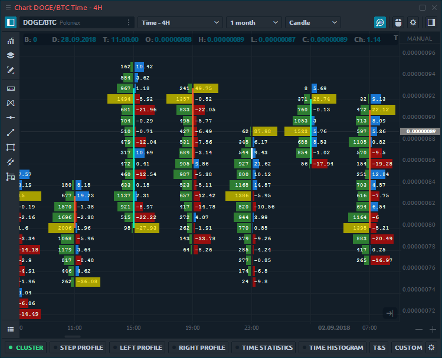

# Cluster chart

**Cluster chart**, known as Footprint chart in other trading platforms, is an advanced chart type that shows a comprehensive view of the candle chart. It allows to look inside the price and see all market actions. Cluster chart combines several important characteristics like time, OHLC prices, trading volume, number of buy and sell trades.

Using this information, a trader can evaluate:

* trading volume, which executed for each price
* zones of maximum volume accumulation
* zones of high trading interest \(the maximum number of trades\)
* the amount of buyers and sellers at each price level

### General settings of cluster chart

Cluster chart has various settings allowing to display volume data from different sides. For example, you can choose different types of data for each bar, as well as configure colors, which will simplify the perception and analysis of volumes, trades, etc.

The main Data Types for cluster chart:

* **Trades** - it's the number of contracts \(trades\) that executed at each price level.
* **Buy \(or Sell\) trades** - it's the number of Buy \(or Sell\) trades that executed at each price level.
* **Volume** - the total size of all positions that executed at each price level or price range.
* **Buy \(or Sell\) Volume** - the total size of all Buy \(or sell\) positions that executed at each price level or price range.
* **Buy \(or Sell\) Volume, %** - shows how many percent of the total volume relates to Buy \(or Sell\) trades
* **Delta and Delta %** - shows the difference in traded Volume between Buyers and Sellers. It allows evaluating who controls the price on the market at a given time.
* **Average size** - the average volume of the position that was executed at a certain price or price range.
* **Buy \(or Sell\) average size** - the average volume of a Buy \(Sell\) position that was executed at a specific price or price range.
* **Max one trade volume \(value and %\)** - shows the maximum volume of a single trade that has executed at a certain price or price range \(depending on the Custom Step \(ticks\) setting\).
* **Filtered volume \(value and %\)** - this parameter displays volumes that exceed the size specified in the filter. If the volume size is smaller than the one specified in the filter, then the values will be zero.
* **Buy \(or Sell\) filtered volume** - the parameter displays Buy \(or Sell\) volumes that exceed the size specified in the filter.


For more efficient analysis of cluster chart, you can display two different data types on one bar at once.


