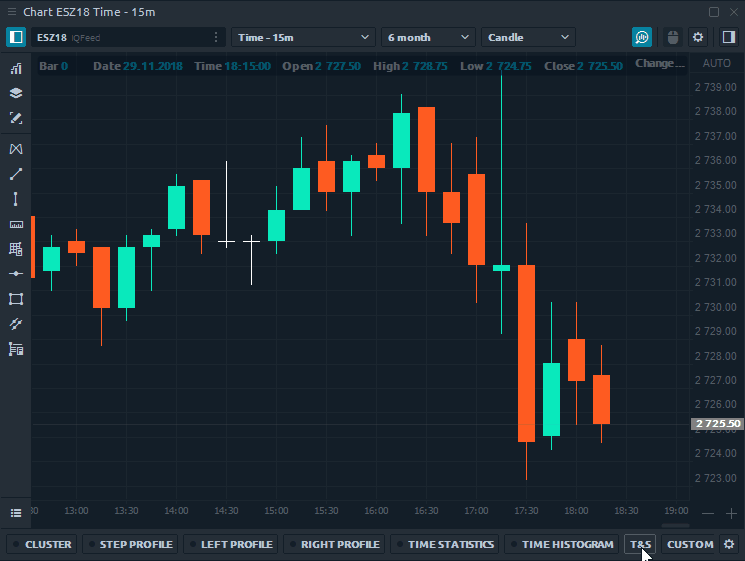
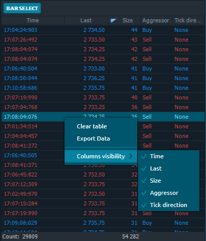

# Historical Time & Sales

Historical Time & Sales tool shows all trades for the selected bar in the form of Time & Sales. Once you have activated the Historical T & S and chose the desired historical bar on the chart, all its trades will be shown in the table in the order of their execution.

Turn on "**Bar Select"** button and select the bar (candle) for which you want to download data. When this mode is turned off, you can continue to work with the chart, while the downloaded data will remain in the table.

### Table actions

By default, the table displays five columns — _Time, Last price, Trade Size, Aggressor flag, Tick direction_. You can move any column of the table left or right, as well as sort or filter data.

By right-clicking on the table, a context menu will appear with several options:

* **Clear table**. Delete all data from the table
* **Export data** to external .csv or .html file
* **Column visibility.** Enable or disable columns in the table

