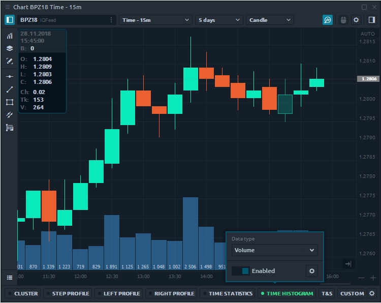
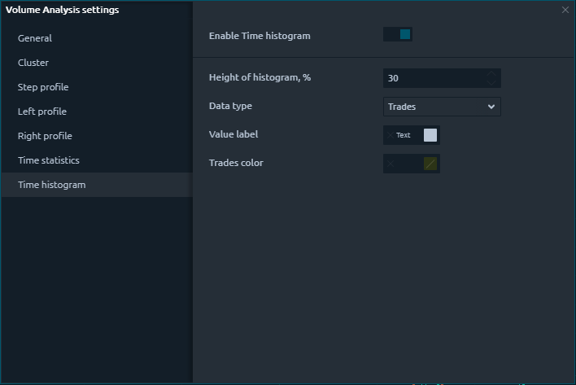
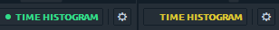
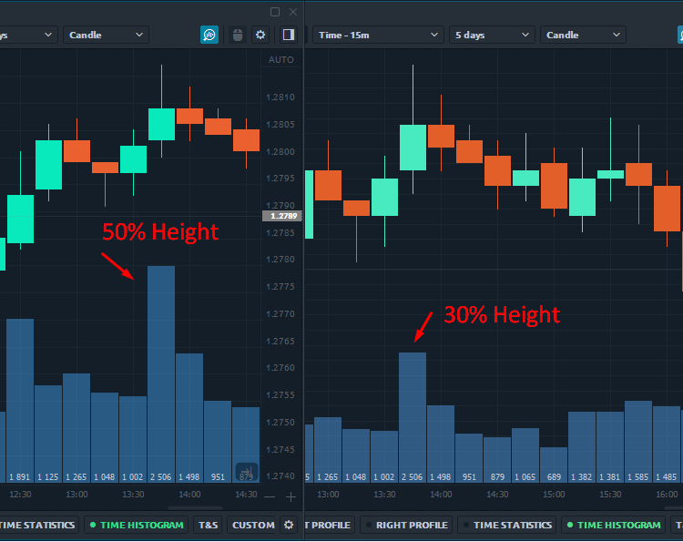

# Time histogram

**Time Histogram** is similar to [Time Statistics](https://help.quantower.com/analytics-panels/chart/volume-analysis-tools/time-statistics) tool that shows volume data as a vertical histogram for each bar. But unlike Time statistics, it allows you to visually evaluate the data for each bar, not only by colors but also by the shape of the histogram.

Click on the **Time Histogram** and switch the button **"Enable"** to activate the functionality on the chart. Time Histogram supports an extensive list of Data types that you can change either in the settings or directly in the activation mode.

* **Enable Time Histogram** — activates the functionality to display on the chart. After you activate it, the loading process of tick and volume data will begin. The yellow color will indicate that data is loading. Green color means that the data for the selected history depth is fully downloaded.

* **Height of Histogram, %** — determines what part of the chart area will be occupied for displaying volume data. If you set the value to 50%, then half of the chart area will be filled by Time Histogram data.

* **Data types** — various types of volume data that can be displayed on a chart. There are trades, volume, bid & ask trades and volume, filtered data, etc. The full list with descriptions of these data types you can find in our Help documentation that describes general information about [**Volume Analysis Tools**](https://help.quantower.com/analytics-panels/chart/volume-analysis-tools).
* **Value label and Data type color** — here you set the color settings for the font and the histogram, respectively.

