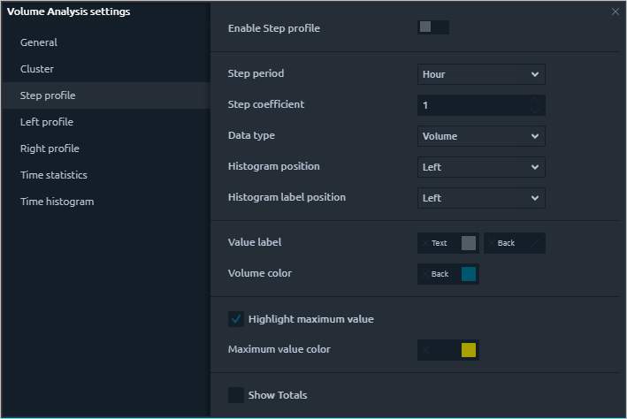

# Volume profiles

**Volume Profile** displays the trading activity over a specific time period at certain price levels. Meaning, it shows what was bought and sold at those current levels, and displays them in a histogram on the side of your chart. Volume Profile allows you to see the zones of maximum trading interest, and as a consequence, the "true" support/resistance levels.

Quantower platform offers four types of Volume profiles:

* **Step Volume Profile**
* **Left Volume Profile**
* **Right Volume Profile**
* **Custom Volume Profile**

### Step Volume Profile

Step profile displays volume profiles with a certain time step. For example, set the step period to 1 hour, and you will see profiles with uniform hourly steps on the graph. By changing the data types, you will see the distribution of the trading volume, the executed trades, as well as the delta for each hour of the trading session.

You can enable Step Profile through the volume analysis toolbar or their settings.

### **General settings of step profile**

