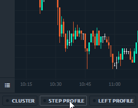
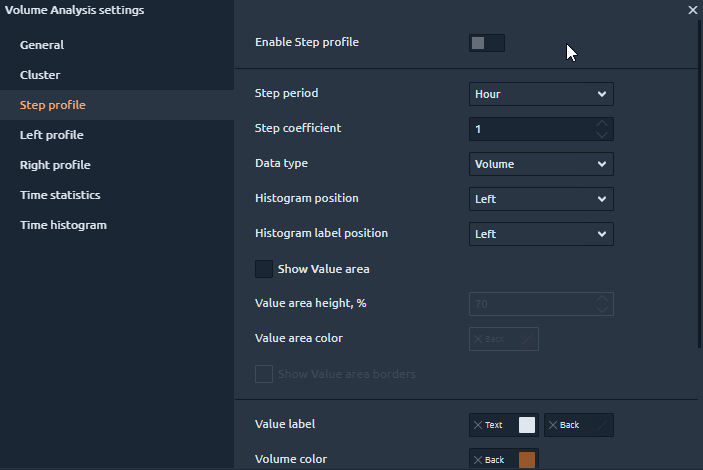
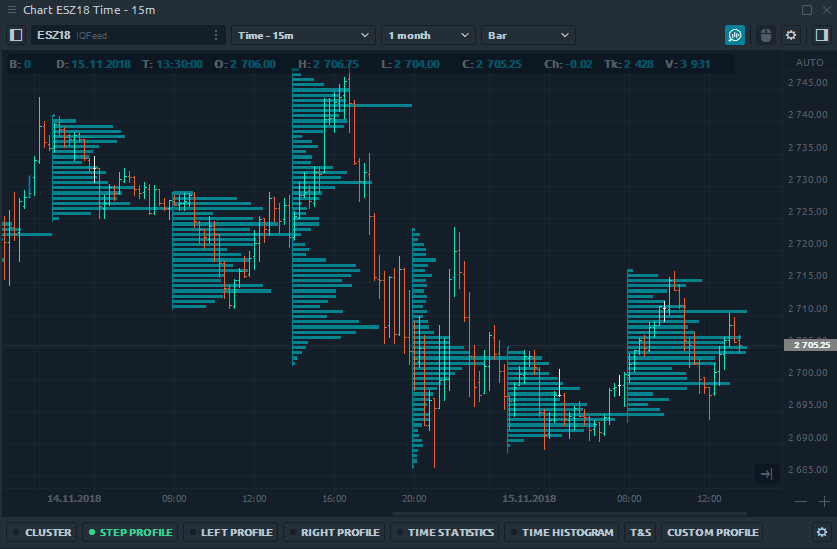
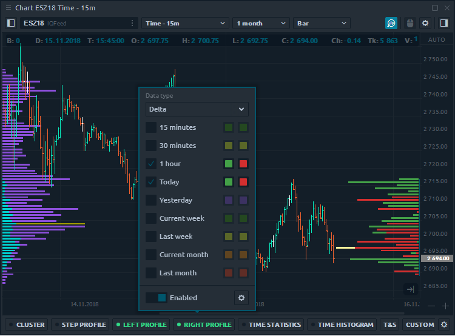
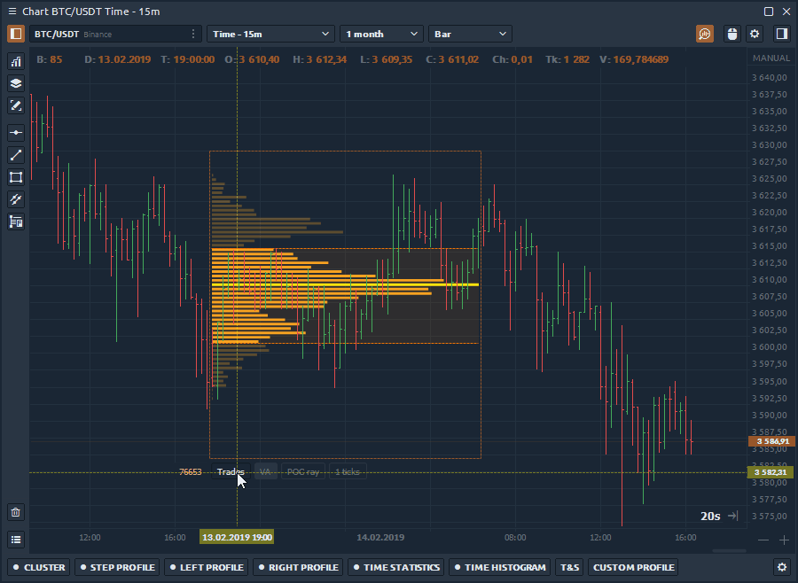
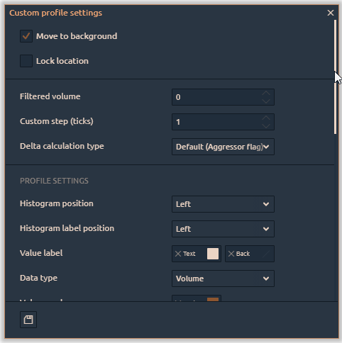

# Volume profiles

**Volume Profile** displays the trading activity over a specific time period at certain price levels. Meaning, it shows what was bought and sold at those current levels, and displays them in a histogram on the side of your chart. Volume Profile allows you to see the zones of maximum trading interest, and as a consequence, the "true" support/resistance levels.

Quantower platform offers four types of Volume profiles:

* \*\*\*\*[**Step Volume Profile**](volume-profiles.md#step-volume-profile)\*\*\*\*
* \*\*\*\*[**Left Volume Profile**](volume-profiles.md#left-and-right-volume-profiles)\*\*\*\*
* \*\*\*\*[**Right Volume Profile**](volume-profiles.md#left-and-right-volume-profiles)\*\*\*\*
* \*\*\*\*[**Custom Volume Profile**](volume-profiles.md#custom-volume-profile)\*\*\*\*

### Step Volume Profile

Step profile displays volume profiles with a certain time step. For example, set the step period to 1 hour, and you will see profiles with uniform hourly steps on the graph. By changing the [**data types**](https://help.quantower.com/analytics-panels/chart/volume-analysis-tools#data-types-of-volume-analysis-tools), you will see the distribution of the trading volume, the executed trades, as well as the delta for each hour of the trading session.

You can enable Step Profile through the volume analysis toolbar or their settings.

#### **General settings of step profile**

* **Step period & Step coefficient** – determines the step to build the profile. Step period has four types –_Minute, Hour, Day, Week_.
* **Data type** – choose any of the [**20+ data types**](./#data-types-of-volume-analysis-tools) to build a step profile
* **Histogram position** – places the profile on the left or right side relative to the starting point.
* **Histogram label position** – determines the position of the data value: _left, right or none_
* **Show Value Area** – shows the price area with 70% of trading activity for the specified time range. The value of 70% is set by default, but the user can change it at his discretion.
* **Show Value Area borders** – shows the outer limits of the Value Area as dotted lines
* **Highlight maximum value** – levels with the maximum value are highlighted with the specified color
* **Show totals** – this option summarizes the data based on which the profile is built.

### Left & Right Volume Profiles

**Left** and **Right volume profile** can be placed on the left and right side of the chart respectively. For example, you can set the delta data on one profile, and on the other the total volume for the same period of time. You can **combine several profiles** that are built on different time periods into one combo profile and put it on left or right chart position.

### Custom Volume Profile

Custom profile allows you to create a profile for any time range.  For instance, you want to see the distribution of the delta on the flat chart or for the impulse bar.  As with other volume analysis tools, you can choose any available data types for display.

After you have placed a custom profile on the chart, a control panel with five options will appear next to it.

* Dublicate profile with the same range and settings
* Move profile to the background or foreground
* Lock current position of the profile. Prohibits the profile movement.
* **Additional settings** for selected profile
* Delete selected profile

### Additional settings for custom profile

In addition to the settings for quick management of custom profile, there are additional settings. Let's take a closer look at what you can customize.

There are a lot of various settings, but the most intersting are:

* **Value Area** — shows the price area with 70% of trading activity for the specified time range. The value of 70% is set by default, but the user can change it at his discretion.
* **POC Ray** — extends the level of maximum volume \(Point of Control\) to the price scale
* **Show Total** — shows/hides the total number under certain profile
* **Custom step \(ticks\)** summarizes the volume data of as many price levels as specified in the setting. By default, the value of the custom step is set to 1 tick, which means the volume data are shown at each price level.

