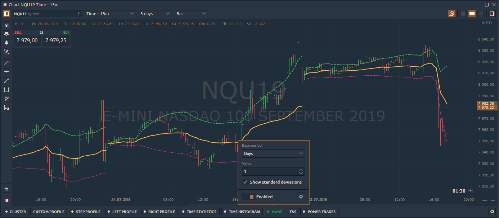
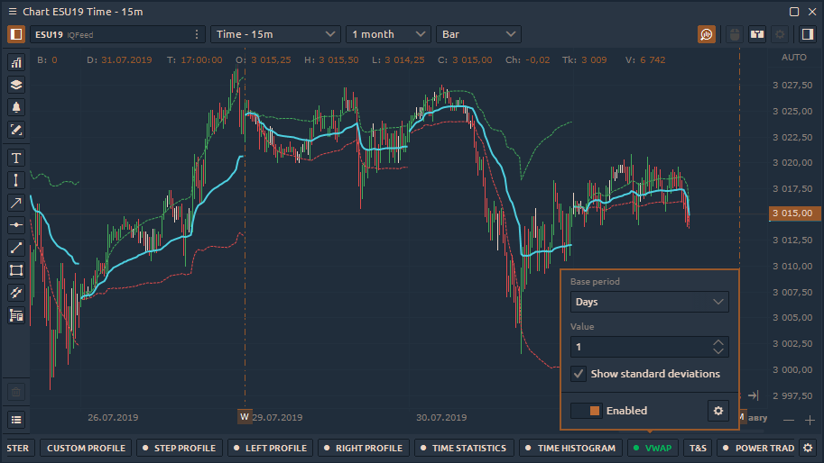
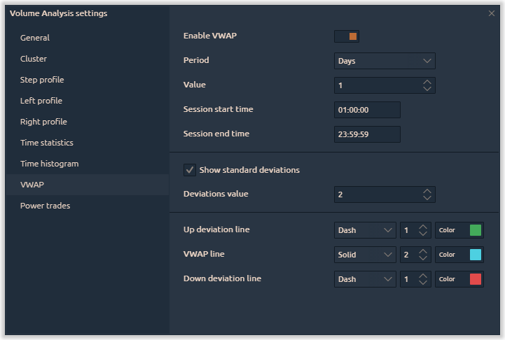

# VWAP

**Volume Weighted Average Price** knows as **VWAP** is a “benchmark” price of an asset for any period of the trading day or session. Average price is weighted by volume for evaluating the overpaying or underpaying of current price relative to the VWAP price.

The indicator is calculated for any period of time according to the following algorithm:

* the average price \(AP\) is calculated for each bar or candle. The calculation is made for each price change for the current candle.  AP = \(H+L+C\)/3
* the average price is multiplied by the volume that has passed in the current candlestick or bar. For example, in real time new trade will increase the volume and thus weigh the price. Thus, for each price or volume change we will get value AP \* V.
* the above values are summed up and divided by the total volume for the specified period. 

                            **VWAP = \(Sum of Average Price \* Traded Volume\) / Cumulative Volume**

## **How to add VWAP to the chart?**

The VWAP indicator is located on the Volume Analysis toolbar. When you click on it, a menu with basic settings and an indicator activation / deactivation switch will appear.

The quick settings menu contains three parameters:

* **Base period and Value** — defines the number of bars \(duration\) on which VWAP will be calculated
* **Show Standard Deviations** — when the parameter is active, the standard deviation lines up and down from VWAP will be additionally calculated on the chart. In the advanced settings you can set the number of standard deviations.
* **Enabled** switch shows or hides the VWAP indicator on the chart

### Advanced indicator settings

By clicking on the "**Gear"** icon, additional settings will open. When choosing a Day period VWAP in the advanced settings, you can set the start and end of the trading session.

You can also set the value and colors for the standard deviation, which will be used in the quick settings.

