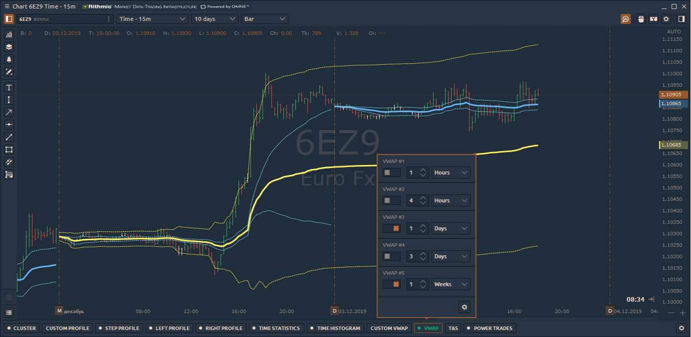
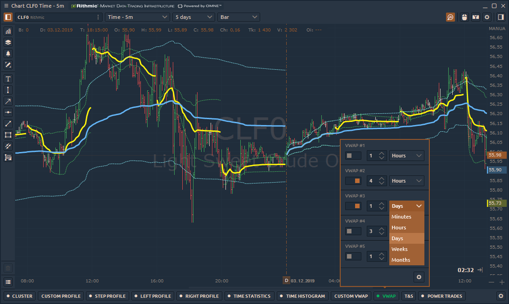
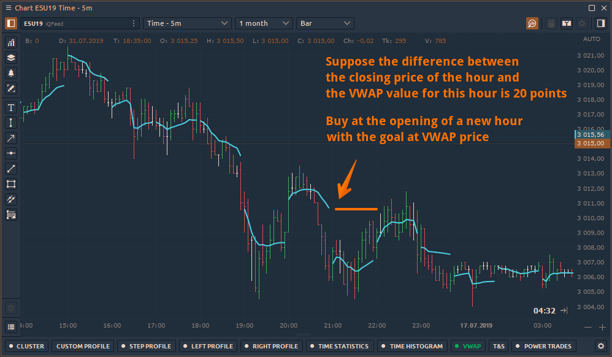
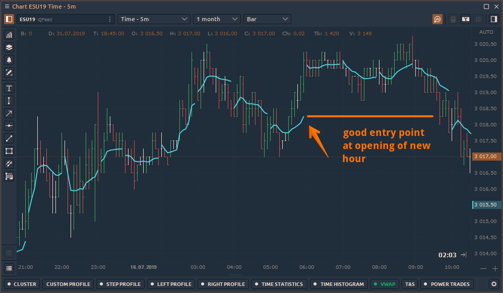
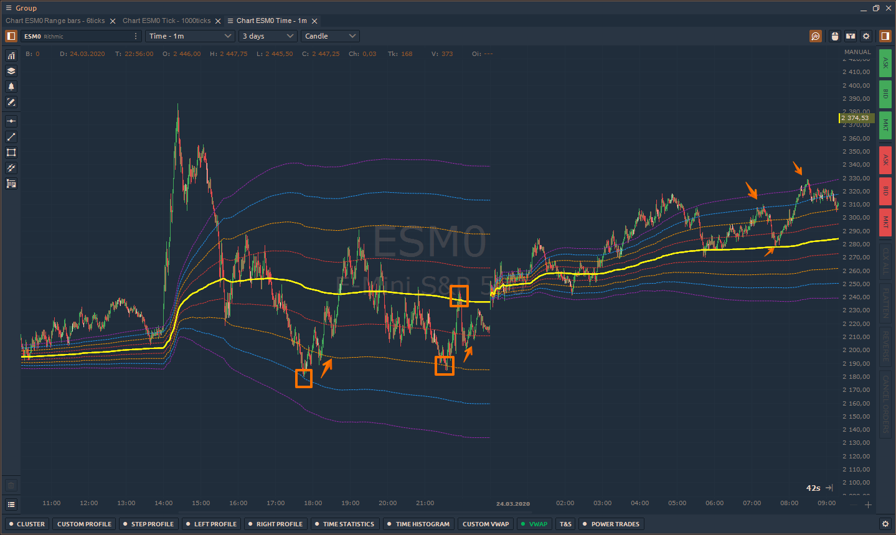

# VWAP \| Volume Weighted Average Price

**Volume Weighted Average Price** knows as **VWAP** is a “benchmark” price of an asset for any period of the trading day or session. Average price is weighted by volume for evaluating the overpaying or underpaying of current price relative to the VWAP price.

The indicator is calculated for any period of time according to the following algorithm:

* the average price \(AP\) is calculated for each bar or candle. The calculation is made for each price change for the current candle.  AP = \(H+L+C\)/3
* the average price is multiplied by the volume that has passed in the current candlestick or bar. For example, in real time new trade will increase the volume and thus weigh the price. Thus, for each price or volume change we will get value AP \* V.
* the above values are summed up and divided by the total volume for the specified period. 

                            **VWAP = \(Sum of Average Price \* Traded Volume\) / Cumulative Volume**

## **How to add VWAP to the chart?**

The VWAP indicator is located on the Volume Analysis toolbar. When you click on it, a menu with basic settings and an indicator activation / deactivation switch will appear.

The quick settings menu contains:

* **Enabled** switch shows or hides the VWAP indicator on the chart
* **Base period and Value** — defines the number of bars \(duration\) on which VWAP will be calculated

### Advanced indicator settings

By clicking on the "**Gear"** icon, additional settings will open. 

**1. Switch between different VWAPs** and set the settings for each of them 

Quantower platform provides 5 separate VWAPs, that can be placed simultaneously on a single chart.

**2.** Set the **Main Settings** for the VWAP line:

* **Data type** — set the data for VWAP calculation: **Ticks** or **Current TF.    Ticks** will use tick data for VWAP calculation and will take much more time for loading    **Current TF** will use Bar data from the current selected Timeframe of your chart. It will use Price type data and multiple it to Bar Volume.
* **Price Type** — select the price for the Current TF data type \(Open, High, Low, Close, HL/2, HLC/3, OHLC/4\)
* **Period and Value** — defines the number of bars \(duration\) on which VWAP will be calculated
* **Forward Extensions** \(type and number\)
* **VWAP line** — visual settings for VWAP itself

**3. Standard Deviation Bands**

When the parameter is active, the standard deviation lines up and down from VWAP will be additionally calculated on the chart. Specify the number of standard deviations in the _**"Value"**_ field and colors

**4. Maximum Permissible Deviation \(MPD\)**

MPD is similar to the standard deviation but is calculated as \(VWAP period high - VWAP period low\)/2.

## How to use VWAP in trading?

VWAP has numerous application in the trading world. It is helpful for both institutional investors and retail intraday traders. Below are some well known applications of VWAP:

* It helps in Buying low and Selling High. If the price is below VWAP, it is considered as undervalued, while price above VWAP is considered as overvalued.
* Crossing of prices above/below VWAP line in chart indicates momentum shift or change of trend.
* VWAP is also used as a trading benchmark by institutional investors who are not worried about the timing of the trade, but who are concerned about the adverse impact of their trades on the price of the security.
* VWAP serves as a reference point for prices for one day. As such, it is best suited for intraday analysis**.** Chartists can compare current prices with the VWAP values to determine the intraday trend.
* VWAP indicator can be used as a dynamic support/resistance line during sideways market.

### \#1 Return to 1 Hour VWAP

For intraday trading we have found that it is possible to trade the return of the price to VWAP on small timeframes. For example, let's consider ES \(e-mini S&P500\) futures on 5-minute chart with an hourly VWAP. 

An important point in this tactic is that the distance between the VWAP value and the closing price should be significant.

### \#2 Trading with STD bands

**Standard deviations** are an objective statistical measurement that quantify variance in a data set, with a small value indicating that most data points are close to the average and a larger value indicating a wider spread. 

By applying this tool to trading with VWAP serving as our average, we can plot these deviations as bands to create a visible unit of measurement to characterize market movement and gauge volatility

Deviation bands are plotted continuously alongside VWAP, automatically adjusting as we receive more data. They typically start off small and expand as price begins to break away from the market's average, but lacking any notable volume or volatility they remain stable throughout the day.

