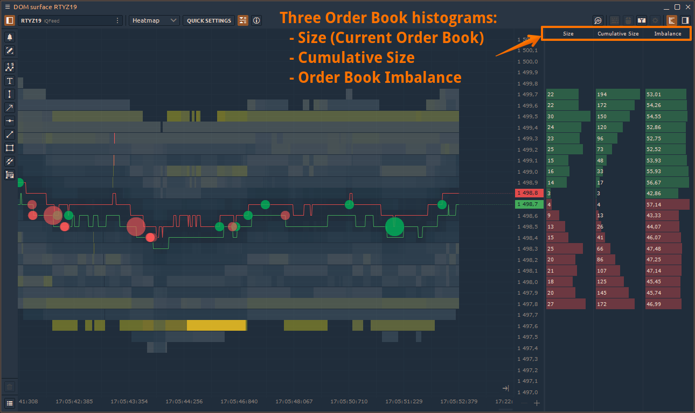

# DOM Surface

Using the **DOM Surface** panel, a trader sees all changes of limit orders in the Order Book (depending on the depth of market data), which is presented as a Heatmap. The panel shows the placement of limit orders, their changing, canceling or execution by large market participants, as well as the imbalance between buyers and sellers.

Unlike other types of charts, such as Footprint (or Cluster chart), the Order Flow shows not only aggressive market orders but also limit orders, which have a greater influence on the price behavior.



### **How To Interpret The DOM Surface Chart**

Price changes due to matching between limit and market orders:

* **Market Sell** order is matched with the **Buy Limit** order at the best bid price.
* **Market Buy** order is matched with the **Sell Limit** order at the best offer price.

**Order Book** shows the volume for Bids & Offers at different price levels, which can be presented as a [DOM table](../trading-panels/dom-trader/) or as a **Heatmap** chart.

At any given time, new orders are placed on the market and existing orders are either changed / canceled or executed. It is very difficult to track all these changes through the DOM table, so the visual representation of this process in the form of Heatmap is more useful.

The main advantage of **Heatmap visualization** over the classic DOM view is that you immediately see the zone of accumulation of large orders that are waiting to get filled. These high liquidity zones are as a "magnet" for the price, as they often match with psychologically price levels or values of popular technical indicators (_MA 200, MA 50, Daily High/Low etc._). Therefore, even in the short term, the price can come to these levels.

Heatmap also shows the dynamics (increase or decrease in volume) of limit orders at certain price levels. Thanks to the gradient color scheme, the trader sees the zones of high interest, which are shown in bright color. The levels with the minimum number of orders have dull colors. This allows you to visually assess the strong support and resistance levels, as well as to understand the reasons for the rapid price changes.

### DOM Surface and Volume Analysis Tools

In addition to visualizing the flow of limit orders, there are Volume Analysis Tools, which show the distribution of trade volume, delta and other data for a selected period of time.

More information about each tool can be found in our documentation in the Analytical Panels — Chart — [Volume Analysis Tools](chart/volume-analysis-tools/) section.

### General Settings

In the panel's general settings there are a number of settings that are identical in other panels, but some are specific to DOM Surface.

**DOM levels count** — shows the number of price levels in each direction from Best Bid and Best Offer.

**Maximal level2 size**  — allows you to adjust the brightness of levels depending on the specified volume value. There are two modes: _**Auto, Custom**_.

For example, let's set the value to 20. All levels where the volume is equal to or exceeds this value will have the brightest color. All levels with the volume less than the set value will have a less vivid coloring proportional to the volume on them.

### Additional DOM Surface columns

On the right side of the panel, there are three histograms — **Size, Cumulative Size, Order Book Imbalance**.

* **Size (Current Order Book)**\
  This histogram shows the volume of limit orders at each price level. User can visually compare the size of each bar for determining the most strong level.
* **Cumulative Size**\
  This histogram displays the sum of sizes of limit orders for each subsequent level. This histogram allows estimating the dominating side of the market.
* **Imbalance (Order Book Imbalance)**\
  This histogram shows the percentage of how much the volume of buy orders exceeds the amount of sell orders (and vice versa) for each price level. It measures whether the limit order book is buy or sell heavy. The more the imbalance exceeds one side, the higher the probability of price movement towards the imbalance. In fact, it is a good predictor of price direction.

