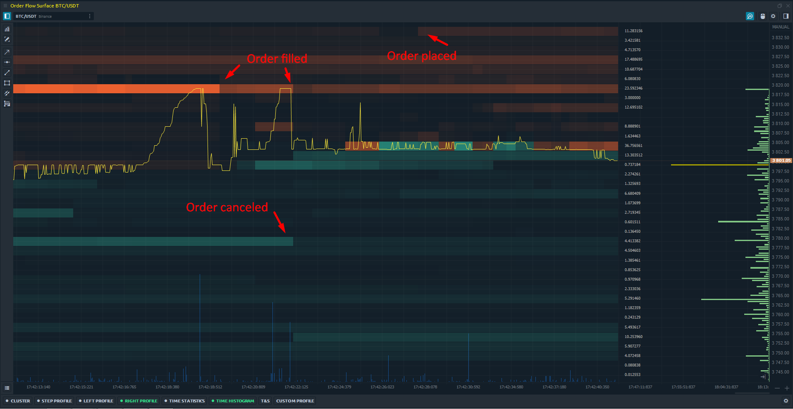

# Order flow surface

**Order Flow Analysis** is a trading method that allows you to predict the actions of large market participants, as well as their intentions regarding the future price.  
  
Using the **Order Flow Surface** panel, a trader sees all changes of limit orders in the Order Book \(depending on the depth of market data\), which is presented as a Heatmap. The panel shows the placement of limit orders, their changing, canceling or execution by large market participants, as well as the imbalance between buyers and sellers.

Unlike other types of charts, such as Footprint \(or Cluster chart\), the Order Flow shows not only aggressive market orders, but also limit orders, which have a greater influence on the price behavior.

### **How To Interpret The Order Flow Chart**

Price changes due to matching between limit and market orders:

* **Market Sell** order is matched with the **Buy Limit** order at the best bid price.
* **Market Buy** order is matched with the **Sell Limit** order at the best offer price.

Order Book shows the volume for Bids & Offers at different price levels, which can be presented as a DOM table or as a Heatmap chart.

At any given time, new orders are placed on the market and existing orders are either changed / cancelled or executed. It is very difficult to track all these changes through the DOM table, so the visual representation of this process in the form of Heatmap is more useful.

The main advantage of Heatmap visualization over the classic DOM view is that you immediately see the zone of accumulation of large orders that are waiting to get filled. These high liquidity zones are as a "magnet" for the price, as they often match with psychologically price levels or values of popular technical indicators \(MA 200, MA 50, Daily High/Low etc.\). Therefore, even in the short term, the price can come to these levels.

Heatmap also shows the dynamics \(increase or decrease in volume\) of limit orders at certain price levels. Thanks to the gradient color scheme, the trader sees the zones of high interest, which are shown in bright color. The levels with the minimum number of orders have dull colors. This allows you to visually assess the strong support and resistance levels, as well as to understand the reasons for the rapid price changes.

