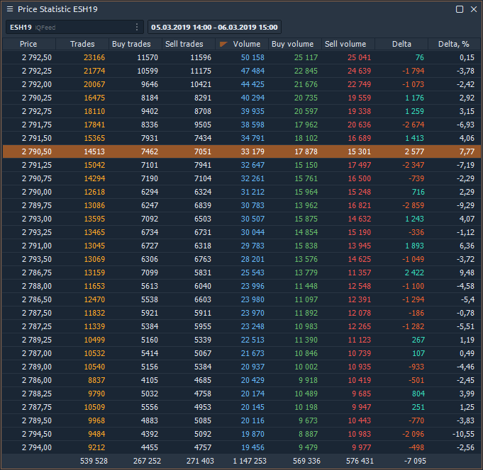
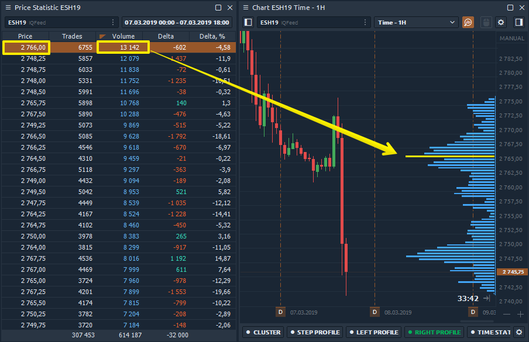
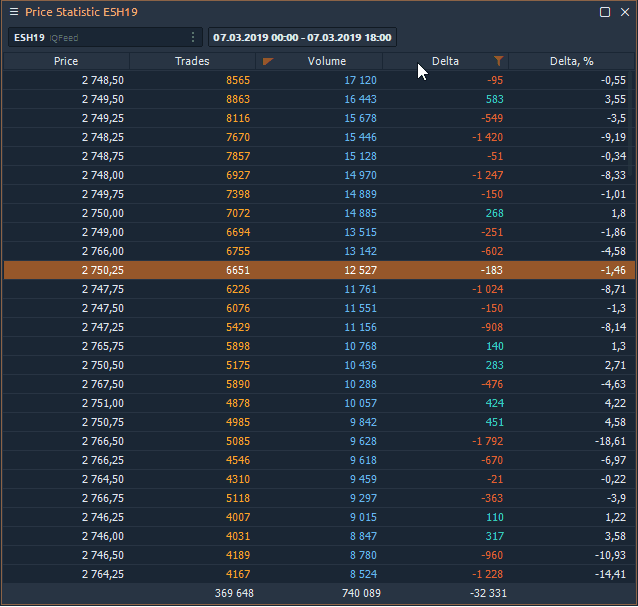

# Price Statistic

**Price Statistic** is essentially a [**volume profile**](chart/volume-analysis-tools/volume-profiles.md) that is presented in tabular form. The panel aggregates the volume data for each price for a selected period of time. By activating the required columns, you will immediately see Trades, Volume, Delta, Average and Maximum Volumes. Filtering and notification system will show the data significant for the trader.

### Price Statistic & Volume Profile. What's the difference?

As we have already said, the Price Statistic panel contains data in the form of a table that shows the volume profile. Below is an image showing how the panel is linked to the volumetric profile. 

The main difference and advantage of the Price Statistic is that the table presents all available volume data for a particular price, which can be sorted or uploaded to an external csv file for further analysis.

Volume profile and data in the Price Statistic table are built for the current day. If you sort the volume column in descending order, the price in the table \($2,766\) will correspond to the POC line on the volume profile.

### How to enable it?

In the main menu of the platform in the _**Analytics category**_, find the Price Statistic panel and click on it to launch it.

### Availalbe Data types in Price Statistic

Each column in the table corresponds to a specific data type that you can show / hide through the panel settings or by right-clicking on the table.

* **Trades** — it's the number of contracts \(trades\) that executed at each price level.
* **Buy \(or Sell\) trades** — it's the number of Buy \(or Sell\) trades that executed at each price level.
* **Volume** — the total size of all positions that executed at each price level or price range.
* **Buy \(or Sell\) Volume** — the total size of all Buy \(or sell\) positions that executed at each price level or price range.
* **Buy \(or Sell\) Volume, %** — shows how many percent of the total volume relates to Buy \(or Sell\) trades
* **Delta and Delta %** — shows the difference in traded Volume between Buyers and Sellers. It allows evaluating who controls the price on the market at a given time.  Delta % = Delta / Volume \* 100
* **Average size** — the average volume of the position that was executed at a certain price or price range.
* **Average Buy size** — the average volume of a Buy position that was executed at a specific price or price range.
* **Average Sell size** — the average volume of a Sell position that was executed at a specific price or price range.
* **Max one trade volume \(value and %\)** — shows the maximum volume of a single trade that has executed at a certain price or price range \(depending on the Custom Step \(ticks\) setting\).
* **Filtered volume \(value and %\)** — this parameter displays volumes that exceed the size specified in the filter. If the volume size is smaller than the one specified in the filter, then the values will be zero.
* **Buy \(or Sell\) filtered volume** — the parameter displays Buy \(or Sell\) volumes that exceed the size specified in the filter.

