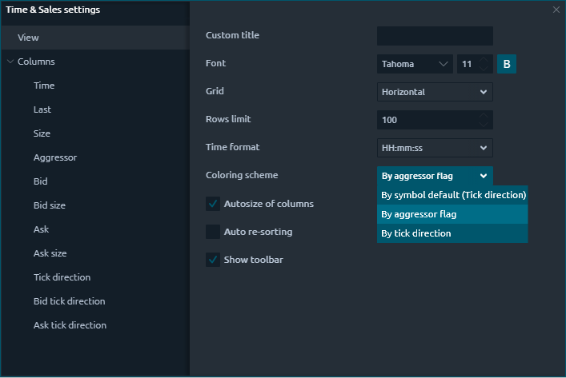

# Time & Sales

### What is Time and Sales

**Time & Sales** panel displays all trades that occur for selected instrument and provides details for each trade including date, time, price, and quantity. Each line is color-coded to indicate whether the trade was a result of an aggressive buyer or seller.

Time & Sales panel keeps a running record of trades for selected instruments displayed in chronological order. Each new entry is added to the top of the list, causing the panel screen to auto-scroll downward.

### General settings

The basic settings in Time & Sales are similar to the parameters of most panels in Quantower — full flexibility in color settings, fonts, columns visibility, data position relative to the column, etc. 

But some settings are unique for this panel:

* **Rows limit** — this is the number of lines that will be displayed in the table, to save the memory of your computer. When the number of lines exceeds the specified value, the old values will be deleted as new ones appear
* **Time format** — allows setting the accuracy of time for executed trades.
* **Coloring scheme** — this option sets the color scheme for all rows of the table, depending on the selected condition:  
  If you chose **“By Aggressor Flag”**, then for the trades with the Buy direction the line will be blue, and for the Sell trades, the line will be red. If the Aggressor flag is not defined \(None\) then the color lime will be white.

  If you selected **“By Tick Direction”**, then the lines will be colored according to the change in the last price.

