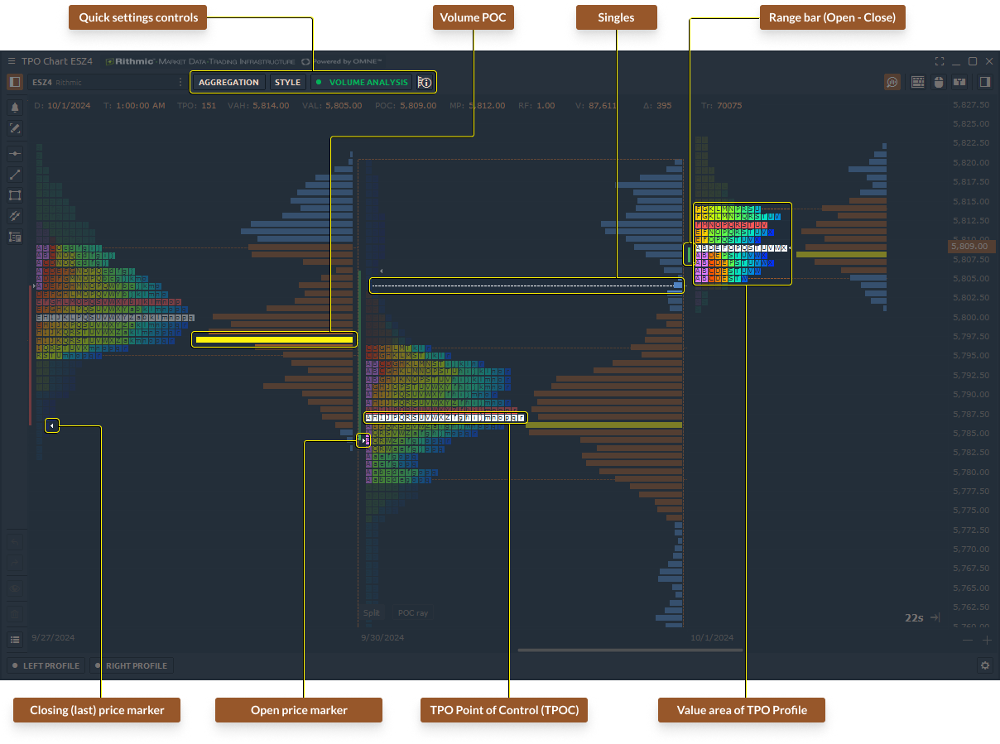

# TPO Profile Chart



**Time Price Opportunity** or **TPO Chart**, shows the price distribution during the specified time, thus forming a profile. This allows you to understand at which levels or ranges the price has spent the most time, as well as to determine the main support and resistance levels.

<figure><figcaption>
TPO Profile Chart (Market Profile) general view in Quantower platform
</figcaption></figure>

<figure><figcaption>
Multiple coloring themes and settings for TPO profile and its different parts
</figcaption></figure>

<figure><figcaption>
TPO profile combined with a volume profile 
</figcaption></figure>

To open a new TPO panel, go to the _**Main menu**_ (Logo icon) and select _**TPO Chart**_ in the Analytics section.

### Key Elements of TPO Profile Chart

<figure><figcaption>
Main Elements of TPO Profile Chart (a.k.a. Market Profile) in Quantower
</figcaption></figure>

**Point of Control (POC)** — price level of the greatest market activity or trading volume. At this level, the price spent most time over the profile range.

**Value Area** — price range in which approximately 68% - 70% of the market activity or trading volume took place.

**Singles** or **single prints** of the profile are placed in the middle of a profile structure, not at the upper or lower edge. They occur on impulse movements and are used as support/resistance zones, which the price can test in the near future. The singles line indicates where the singles begin to form (in cases when there are several single prints).

**TPO letters** — a basic element of the TPO chart, where each letter corresponds to a specific time ("**Build From**").

## Main Controls of TPO Chart

There are three main controls on the top toolbar of TPO chart panel:

* [**Aggregation**](tpo-chart.md#aggregation-of-tpo-profile-chart)
* [**Style**](tpo-chart.md#style-settings-of-tpo-profile-chart)
* [**Volume Analysis**](tpo-chart.md#volume-analysis)

### Aggregation of TPO Profile Chart

The base element of a **TPO Chart** is letters, which are used to create the market profile structure. Each letter represents a 30-minute period by default. In Quantower, you can customize the aggregation settings to define how the profile is built. For example, a daily profile made up of 30-minute bars is considered "standard." However, you can set a lower value for **"**<mark style="background-color:green;">**Build From**</mark>**"** to create a more detailed, granular profile, or set a higher value for a smoother, less detailed profile.

<figure><figcaption>
TPO Profile can be build with any custom period and base
</figcaption></figure>

* **Build From (Minute, Hour, Day)** — this parameter determines the length of time for building each letter (for A, B, C etc.).
* **Profile Aggregation** — defines the range for each TPO profile. The standard range is 1 day, but there are several base ranges for building each profile — **Minute, Hour, Day**.\
  For example, a 1-day range will start at the beginning of the trading day and finish at the end of the current trading day (defined in the trading hours or by custom session).
* **History Range** — determines the depth of history for building TPO profiles. At a high depth of history, volume profiles can be built for a long time, because they use tick data.
* **Custom Step (Ticks)** — this parameter defines the height and number of letters in the profile.\
  _If enabled_, the letter height will correspond to the number of ticks that is set in the parameter.\
  _If disabled_, the height and number of letters will be selected automatically using a smart algorithm. As a result, the chart will look the most optimal for analysis.

### Style settings of TPO Profile Chart

Customize the **TPO Profile Chart** using various style settings for better representation and analysis. You can adjust the color scheme and enable features like **POC**, **Value Area**, **Singles**, **Standard Chart**, and more.

* **Display** — choose how the letters in the TPO profile are displayed: **Boxes** or **Letters**.

<figure><figcaption>
Display TPO Profile as Filled Boxes or Letters
</figcaption></figure>

* **Coloring Mode —** Pick a color scheme that works best for your analysis. There are 10 coloring modes available — **Single Color, Up/Down Profile, Up/Down Bars, Heatmap, Delta Profile, Delta Price, Delta Bars, Volume Profile, Volume Price, Volume Bars**.\

* **POC Type** — price level of the greatest market activity or trading volume on the chart. Available two types:\
  \
  **Final POC**: Shows a single line for the POC.\
  **Migrating POC**: Shows how the POC changes during a trading day or selected session.

* **Show Value Area** — enable the **Value Area**, which highlights the price range where approximately 68% to 70% of the trading activity occurred.\

* **Show Singles** (also called single prints) appear in the middle of a profile structure, not at the top or bottom edge. They occur during impulsive price moves and act as potential support/resistance zones. The **single line** indicates where these single prints begin to form.\

* **Midpoint** displays the midpoint of the profile, showing at what price the center of the profile is located.\

* **Initial Balance (IB)** represents the price range typically formed during the first hour of a trading session or day. You can adjust the duration for the Initial Balance in the settings (e.g., 10 minutes, 30 minutes, etc.).

### Volume Analysis

TPO profiles are used on their own to find areas of support and resistance, and can also be used in conjunction with volume profiles. For this, we have added **Volume Analysis** control to the top toolbar of the panel. Here you can select the data type and show/hide the POC & Value Area.

Switch Volume Profile between [**different data types**](chart/volume-analysis-tools/#data-types-of-volume-analysis-tools), such as delta, buy\&sell, trades, volume, etc.

## Splitting & Merging of TPO Profile Chart

Use TPO splitting for a detailed analysis of profile formation. There are two splitting modes available in the platform:

* **Split full profile**, that separates the TPO profile into each bar or letter. To separate profile into columns, click on the profile and press _**"Split"**_ button that is placed on the lower border of a selected profile.

* **Divide by bar**, that option splits the profile in half on the selected bar. To separate TPO profile in half, select a necessary profile and right-click to open the context menu and click on _**"Divide by bar"**_ button.

### Merging of TPO Profile

**Merge** is a feature that combines several profiles into one. Right-click on the selected profile to open the context menu and select **Merge Left** or **Merge Right**. To return profiles to their original positions, press the Reset button.

## Session Time

Set the custom time range for the necessary trading session using [<mark style="background-color:blue;">**Sessions Manager**</mark>](../miscellaneous-panels/sessions-manager.md#how-to-set-custom-trading-sessions-for-futures-on-cqg-rithmic) and the profile will be built within this range. The rest of the time the profile will not take into account.

To switch between necessary sessions, go to the **TPO Chart settings -> View -> Sessions Template.**

There also you can find the setting **Show our of session history** that will hide/show bars (candles) that are placed beyond the time of the selected session. Note that it works only if you activate Bars data on TPO chart

## Additional settings of TPO Profile

Right-click on the chart area -> **Settings** to open settings of the TPO Chart panel.



.png>)

There you can set Style of TPO profiles (colors, Value area et.), POC type, Midpoint, Initial Balance, Volume Analysis, TPO Statistics



.png>)



.png>)



 (2).png>)



.png>)





General settings for **Visual trading on TPO Profile** chart

 (1) (2).png>)

Settings for **Positions on TPO** **Profile** chart

.png>)

Settings for **Orders on TPO Profile** chart

 (1).png>)

Settings for **Trades on TPO Profile** chart

.png>)

Settings for **SL/TP on TPO Profile** chart

 (1) (2) (1) (1).png>)



.png>)

These settings are responsible for this panel:

.png>)














