# TPO Profile Chart



**Time Price Opportunity** or **TPO Chart**, shows the price distribution during the specified time, thus forming a profile. This allows you to understand at which levels or ranges the price has spent the most time, as well as to determine the main support and resistance levels.

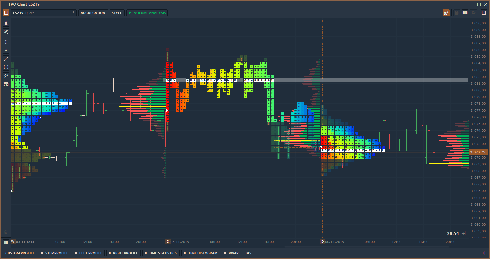

To open new TPO panel, go to _**Main menu**_ \(Logo icon\) and select _**TPO Chart**_ in the Analytics section.

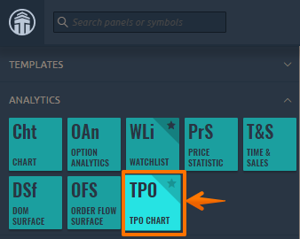

### Key Elements of TPO Profile Chart

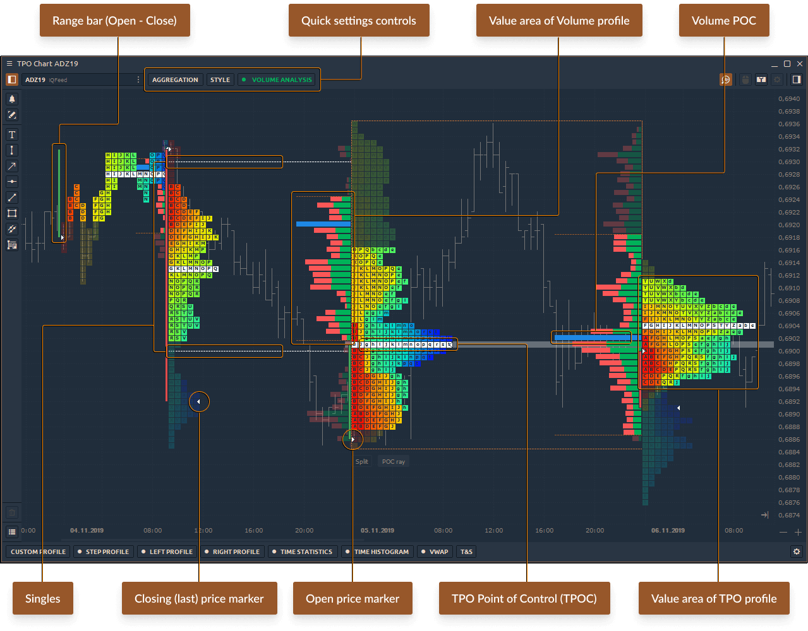

**Point of Control \(POC\)** — price level of the greatest market activity or trading volume. At this level, the price spent most time over the profile range.

**Value Area** — price range in which approximately 68% - 70% of the market activity or trading volume took place.

**Singles** or **single prints** of the profile are placed in the middle of a profile structure, not at the upper or lower edge. They occur on impulse movements and are used as support/resistance zones, which the price can test in the near future. The singles line indicates where the singles begin to form \(in cases when there are several single prints\).

**TPO letters** — basic element of the TPO chart, where each letter corresponds to a specific time \("**Build From**"\).

## Main Controls of TPO Chart

There are three main controls on the top toolbar of TPO chart panel:

* \*\*\*\*[**Aggregation**](tpo-chart.md#aggregation-of-tpo-profile-chart)\*\*\*\*
* \*\*\*\*[**Style**](tpo-chart.md#style-settings-of-tpo-profile-chart)\*\*\*\*
* \*\*\*\*[**Volume Analysis**](tpo-chart.md#volume-analysis)\*\*\*\*

### Aggregation of TPO Profile Chart

The base element of the TPO chart is letters that are used to build the market profile structure. Each letter initially represents a half-hour period. Quantower offers to specify in the aggregation settings any values on the basis of which the profile will be built. For example, a daily profile of 30-minute bars is considered as a “standard”. But you can set a lower value of “**Build From**” and the profile will be more granular. Conversely, set the value higher and the shape of the profile will be smoother.

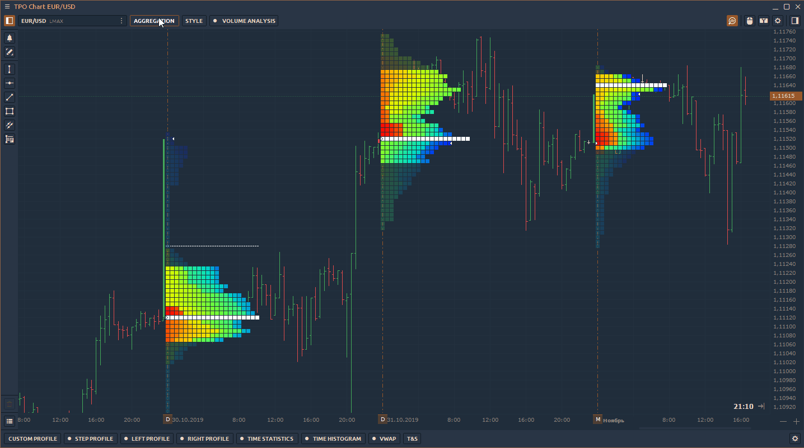

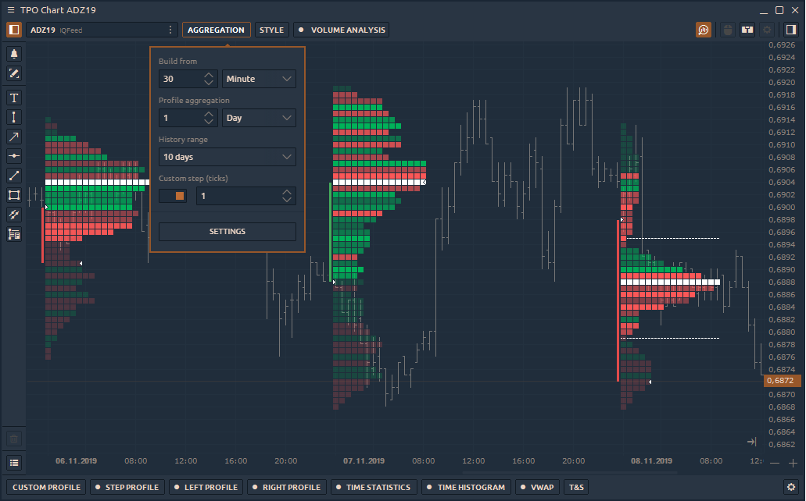

* **Build From \(Minute, Hour, Day\)** — this parameter determines the length of time for building each letter \(for A, B, C etc.\).
* **Profile Aggregation** — defines the range for each TPO profile. The standard range is 1 day, but there are several base ranges for building each profile — **Minute, Hour, Day**. For example, a 1 day range will start at the beginning of the trading day and finish at the end of the current trading day \(defined in the trading hours or by custom session\).
* **History Range** — determines the depth of history for building TPO profiles. At a high depth of history, volume profiles can be built for a long time, because they use tick data.
* **Custom Step \(Ticks\)** — this parameter defines the height and number of letters in the profile. _If enabled_, the letter height will correspond to the number of ticks which is set in the parameter. _If disabled_, the height and number of letters will be selected automatically using a smart algorithm. As a result, the chart will look the most optimal for analysis.

### Style settings of TPO Profile Chart

Choose any color scheme for better representation and analysis of the TPO profile as well as enable POC, Value Area, Singles, Standard Chart etc.

* **Display** — mode for dispalying letters of TPO profile — **Boxes** or **Letters**.

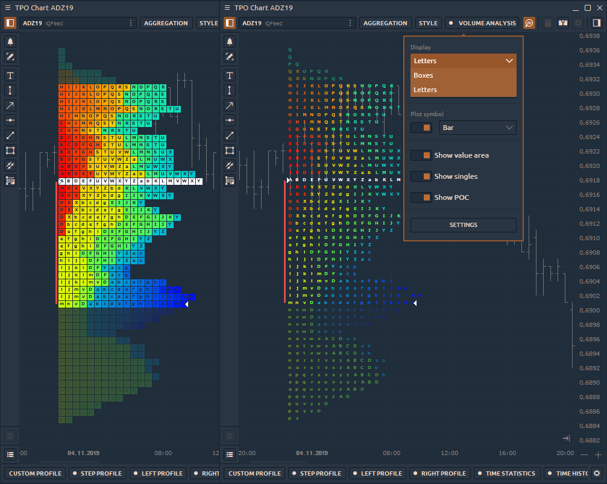

* **Coloring Mode —** choose any color scheme for better representation and analysis of the TPO profile. Currently, there are 10 different coloring modes available — **Single Color, Up/Down Profile, Up/Down Bars, Heatmap, Delta Profile, Delta Price, Delta Bars, Volume Profile, Volume Price, Volume Bars**. 
* **POC Type** — price level of the greatest market activity or trading volume on the chart. Available two types:  **Final POC**, shows the single line **Migrating POC**, which shows the change of POC during a trading day or a selected session.

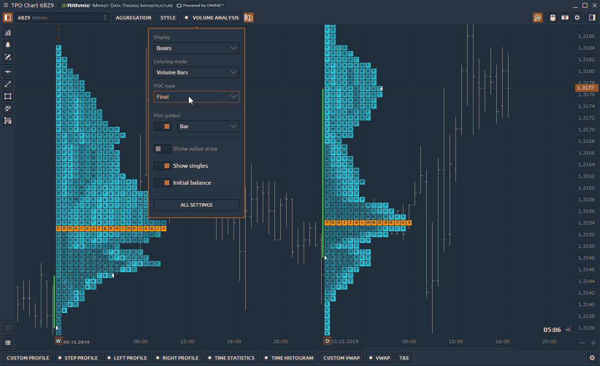

* **Plot Symbol** — show/ hide the standard chart on the TPO Profile chart. Select a ****[**chart style**](chart/chart-types/#chart-types-and-styles)**:** _**Bar, Candle, Line, Area, Dotted Line, Quantower style**_.

* **Show Point of Control \(POC\)** — enable a price level of the greatest market activity or trading volume on the chart. At this level, the price spent most time over the profile range. 
* **Show Value Area** — enable price range in which approximately 68% - 70% of the market activity or trading volume took place. 
* **Show Singles** or **single prints** of the profile are placed in the middle of a profile structure, not at the upper or lower edge. They occur on impulse movements and are used as support/resistance zones, which the price can test in the near future. The singles line indicates where the singles begin to form \(in cases when there are several single prints\).

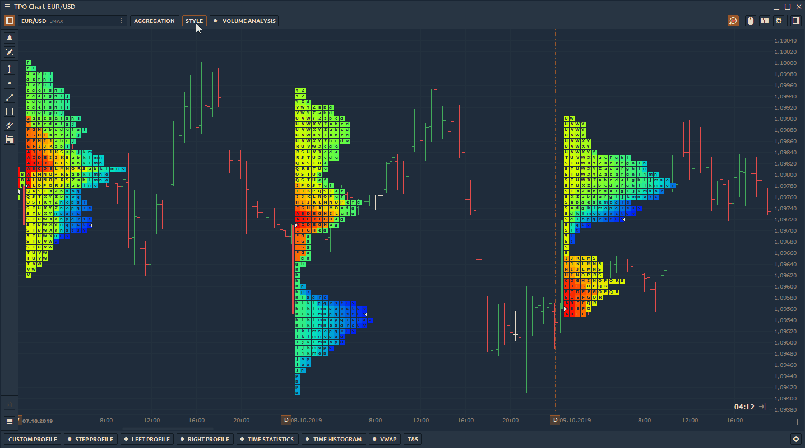

### Volume Analysis

TPO profiles are used on their own to find areas of support and resistance, and can also be used in conjunction with volume profiles. For this, we have added **Volume Analysis** control to the top toolbar of the panel. Here you can select the data type and show/hide the POC & Value Area.

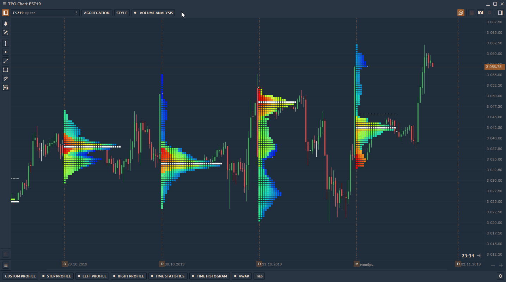

Switch Volume Profile between [**different data types**](chart/volume-analysis-tools/#data-types-of-volume-analysis-tools), such as delta, buy&sell, trades, volume, etc.

## Splitting & Merging of TPO Profile Chart

Use TPO splitting for a detailed analysis of profile formation. There are two splitting modes available in the platform:

* **Split full profile**, that separates the TPO profile into each bar or letter. To separate profile into columns, click on the profile and press _**"Split"**_ button that is placed on the lower border of a selected profile.

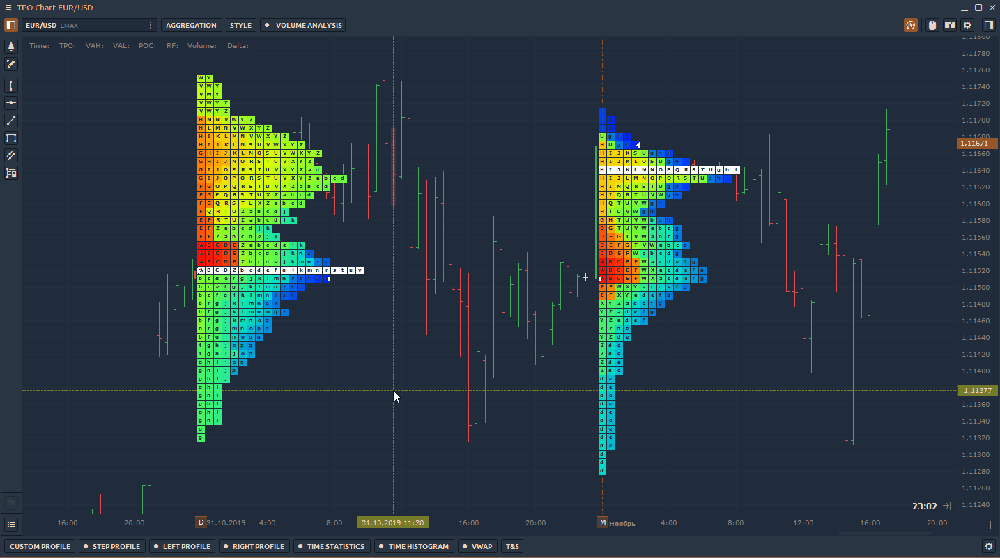

* **Divide by bar**, that option splits the profile in half on the selected bar. To separate TPO profile in half, select a necessary profile and right-click to open the context menu and click on _**"Divide by bar"**_ button.

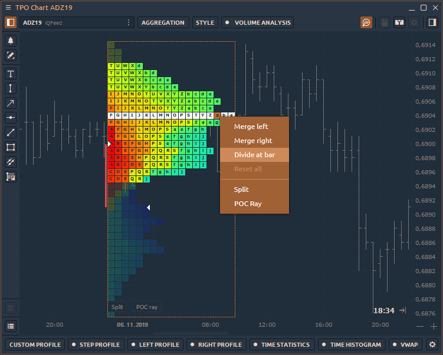

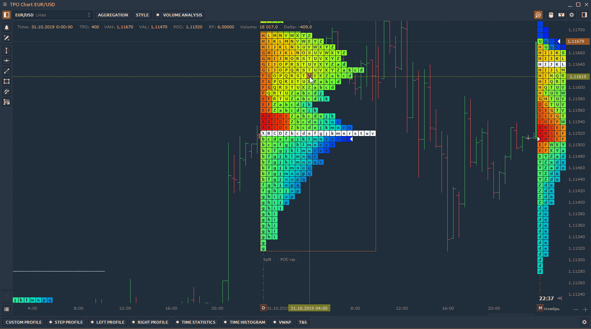

### Merging of TPO Profile

**Merge** is a feature that combines several profiles into one. Right-click on the selected profile to open the context menu and select **Merge Left** or **Merge Right**. To return profiles to their original positions, press the Reset button.

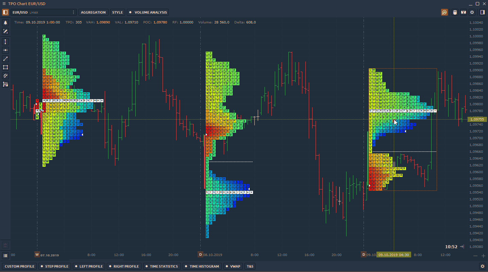

## Session Time

Set the custom time range for the necessary trading session and the profile will be built within this range. The rest of the time the profile will not take into account.

To set the time of the necessary session, go to the **TPO Chart settings -&gt; View -&gt; Custom session.** Set the time according the time zone.

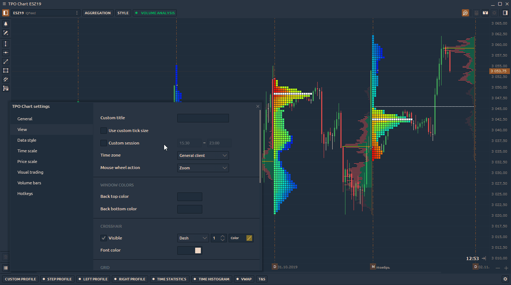

## Additional settings of TPO Profile

Right-click on the chart area -&gt; **Settings** to open the general settings of the TPO Chart panel. 

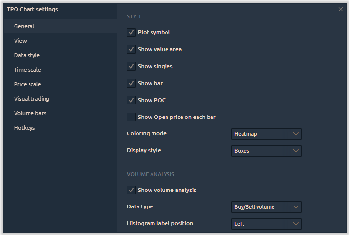

